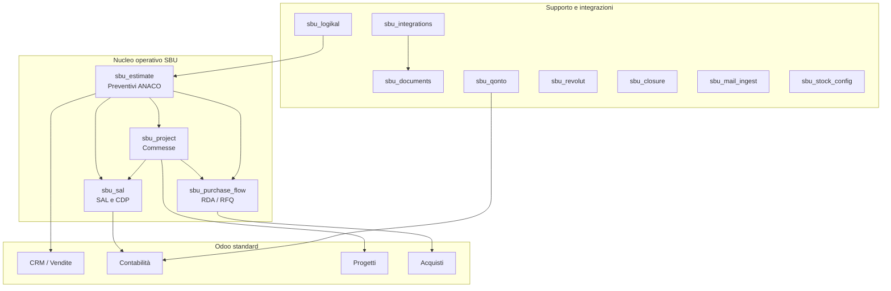
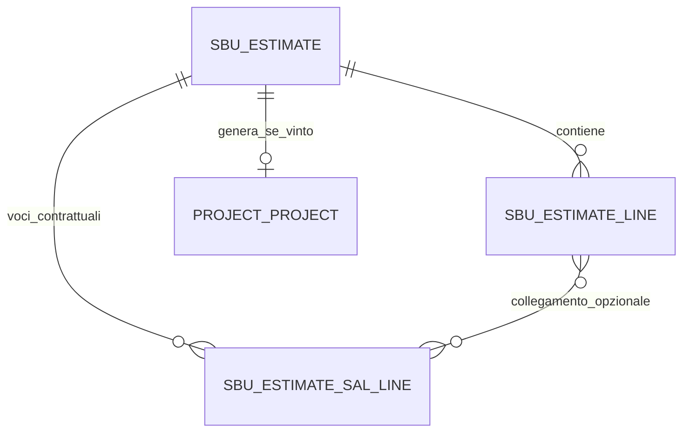
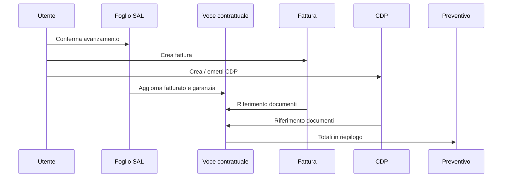

# Report di avanzamento — Piattaforma SBU su Odoo 19

**Cliente:** Suburban SRL a Socio Unico  
**Oggetto:** Sviluppo personalizzato Odoo (preventivi ANACO, commesse, SAL, acquisti, integrazioni)  
**Versione documento:** 1.0 — maggio 2026  
**Repository:** `pignatelli111/my-odoo` (rami `main` sviluppo, `production` produzione)  
**Ambiente:** Odoo.sh — Odoo **19.0**  
**Presentazione con screenshot (italiano):** [presentazione-cliente/REPORT_PRESENTAZIONE_CLIENTE_IT.md](presentazione-cliente/REPORT_PRESENTAZIONE_CLIENTE_IT.md)

---

## 1. Sintesi esecutiva

È stata realizzata una **base operativa su Odoo 19** per Suburban SRL, con interfaccia utente **interamente dentro Odoo** (nessun cruscotto esterno proprietario), allineata al flusso aziendale:

- **Preventivo** digitale derivato dal foglio Excel **ANACO**
- **Voci contrattuali SAL** collegate al preventivo e, in fase esecutiva, alle **fatture** e ai **certificati di pagamento (CDP)**
- **Commessa / progetto** generata dal preventivo vinto
- **SAL (Stato Avanzamento Lavori)** con trattenute (garanzia), fatturazione cliente e certificati
- Moduli aggiuntivi per **acquisti (RDA/RFQ)**, **documenti**, **integrazioni** (Microsoft 365, Qonto, Logikal, ecc.)

Il codice è versionato su GitHub e distribuito tramite **Odoo.sh**. L’ultimo rilascio testato con esito positivo su Odoo.sh è il commit **`397ed3d`** (correzioni campi calcolati SAL/finanziari).

---

## 2. Principi architetturali

| Principio | Scelta adottata |
|-----------|-----------------|
| Frontend operativo | **Solo Odoo** (web standard Odoo 19) |
| Motore preventivi | Modulo custom **`sbu_estimate`** (non Excel in produzione) |
| Localizzazione contabile | Italia (piano dei conti / app contabilità italiana) |
| Deploy | **Odoo.sh** + Git (`main` → dev, `production` → prod) |
| Dati ANACO storici | Import Excel opzionale; formule replicate in Odoo |

---

## 3. Architettura moduli (panoramica)

### 3.1 Elenco moduli custom

| Modulo | Funzione principale |
|--------|---------------------|
| **sbu_estimate** | Preventivi, righe ANACO, distinte (BOM), voci contrattuali SAL, import Excel, revisioni, approvazione opzionale, CRM |
| **sbu_project** | Collegamento commessa ↔ preventivo vinto |
| **sbu_sal** | Fogli SAL, righe avanzamento, fattura cliente, certificato di pagamento, ritenute |
| **sbu_purchase_flow** | Richieste di acquisto (RDA), confronto offerte, RFQ da BOM preventivo |
| **sbu_stock_config** | Ubicazioni / percorsi magazzino SBU |
| **sbu_documents** | Hub documenti, link M365, cartelle progetto |
| **sbu_integrations** | Parametri Graph, OneDrive, Logikal; wizard JSON impostazioni dev→prod |
| **sbu_logikal** | Import prodotti/BOM da export Logikal (CSV/JSON o API) |
| **sbu_qonto** / **sbu_revolut** | Import movimenti bancari (scheda azienda, non flusso “Connect bank” standard) |
| **sbu_closure** | Requisiti chiusura commessa / tipi documento |
| **sbu_mail_ingest** | Alias email per RFQ/ordini fornitore |

---

## 4. Flusso operativo end-to-end

### 4.1 Diagramma del processo principale

### 4.2 Fase 1 — Preventivo (menu **SBU → Preventivi**)

**Obiettivo:** sostituire il foglio Excel ANACO come strumento di lavoro quotidiano, mantenendo la logica di calcolo.

**Funzionalità implementate:**

- Intestazione: cliente, sito, revisione (`REV00`, `REV01`, …), scenario commerciale, riferimenti
- **Righe preventivo (ANACO):**
  - Dimensioni B × H, quantità, **MQ/Cad.** e **Mq tot.**
  - Unità di calcolo (MQ, ML, Nr-Pz, a corpo)
  - Famiglia di costo
  - Costo e prezzo al MQ, margini per riga
  - Catena sconti (listino, Sc1–Sc3, prezzi dopo sconti)
  - Note / assunzioni per riga
- **Import Excel ANACO** (wizard sul preventivo)
- **Voci contrattuali SAL** (tab dedicata):
  - Importo contrattuale, SAL-1 … SAL-10 %, cumulativo %
  - Collegamento **righe preventivo** (uno-a-uno, molti-a-uno o manuale)
  - **Fatturato ad oggi** e **importo residuo** (da SAL confermati/fatturati)
  - **Ritenuta %**, **importo garanzia**, **trattenuto**, **residuo garanzia**
  - **Riferimento fattura / CDP** e collegamenti ai documenti contabili
- Stati: Bozza → Inviato → Vinto / Perso; nuova revisione; opzionale approvazione interna
- **Opportunità CRM** (campo opzionale; richiede profilo vendite)
- Riepilogo economico: totali MQ, prezzo cliente, costi, margine, totali SAL e garanzia

### 4.3 Fase 2 — Commessa (progetto)

**Trigger:** pulsante **Vinto** → wizard creazione commessa.

- La commessa eredita riferimenti dal preventivo (cliente, valore contrattuale in descrizione)
- Collegamento bidirezionale preventivo ↔ commessa
- **Azienda (company)** allineata al preventivo (multi-azienda)

### 4.4 Fase 3 — SAL e amministrazione (menu **SBU → SAL**)

**Obiettivo:** collegare l’avanzamento lavori alla contabilità e all’amministrazione.

| Passo | Azione utente | Risultato in sistema |
|-------|---------------|---------------------|
| 1 | Creare **foglio SAL** sulla commessa | Legame a progetto e preventivo |
| 2 | Inserire **righe SAL** con **voce contrattuale SAL** | Importi e descrizione da preventivo |
| 3 | Impostare **% SAL corrente** | Importo SAL riga calcolato |
| 4 | **Confermare** il foglio | Stato Confermato |
| 5 | **Fattura cliente** | Movimento contabile (bozza o validata, policy azienda) |
| 6 | **Certificato di pagamento (CDP)** | Emissione; collegamento pagamento se fattura saldata |

**Ritenuta (garanzia):**

- % configurabile su foglio SAL e su voce contrattuale (default aziendale, tipicamente 5 %)
- In fattura: righe lordo + ritenuta su conto garanzia (se configurato in azienda)
- Sul preventivo: **trattenuto ad oggi** e **pool garanzia residuo**

**Collegamenti finanziari sulla voce contrattuale:**

- Tag **CDP** e **fatture cliente**
- Campo testo **Riferimento fattura / CDP** (sintesi automatica)
- Pulsanti per aprire elenco CDP / fatture

### 4.5 Fase 4 — Acquisti (opzionale, **sbu_purchase_flow**)

- Da commessa: creazione **RDA** da distinta preventivo
- Workflow: Bozza → Inviata → Approvata → **RFQ** fornitore
- Non sostituisce automaticamente il SAL; è il braccio **costi / approvvigionamento**

---

## 5. Impostazioni e integrazioni

### 5.1 Impostazioni SBU

- Parametri sotto **Impostazioni → Impostazioni generali** (ricerca: *SBU*, *Graph*, *Logikal*)
- Wizard **SBU settings JSON (dev → prod)** per copiare parametri `sbu.*` tra database
- **Qonto / Revolut:** scheda **Azienda**, moduli dedicati (non il connettore bancario Enterprise generico se non in abbonamento)

### 5.2 Logikal / ReynaPro

- Il file SQLite Orgadata **non** è letto direttamente da Odoo
- Percorso previsto: **export CSV/JSON** o **API** (parametri in impostazioni)

### 5.3 Dominio e ambienti

- URL Odoo.sh assegnato (es. `…-my-odoo.odoo.com`) oppure dominio proprio con **CNAME** verso Odoo.sh
- Database **sviluppo** su Odoo.sh: temporaneo (24–48 h), senza backup — solo test

---

## 6. Deploy e qualità

| Ambiente | Ramo Git | Uso |
|----------|----------|-----|
| Sviluppo | `main` | Test funzionali, formazione |
| Produzione | `production` | Operatività (dopo merge da `main`) |

**Procedura standard:**

1. Push su `main` → build Odoo.sh dev → **Aggiorna app** moduli modificati  
2. Merge `main` → `production` → build prod → **Aggiorna app** in produzione  

**Stato test Odoo.sh (riferimento):**

| Commit | Esito build/test |
|--------|------------------|
| `bd5a859` | Successo |
| `856802f` | Warning (campi calcolati) |
| `2631984` | Fallito (stesso tema) |
| `397ed3d` | **Successo** (correzione campi calcolati SAL) |

---

## 7. Cosa è coperto vs. evoluzioni future

### 7.1 Coperto nell’implementazione attuale

- Preventivo ANACO in Odoo con import Excel e formule principali
- Revisioni, stati, link CRM opzionale
- Voci contrattuali SAL con tracciamento **fatturato / residuo / garanzia**
- Collegamento SAL → fatture e CDP → preventivo
- Commessa da preventivo vinto
- SAL con ritenute e fatturazione
- Base moduli acquisti, documenti, integrazioni

### 7.2 Non ancora automatizzato (da pianificare se richiesto)

- Sincronizzazione automatica colonne **SAL-1…SAL-10 %** sul preventivo con i fogli SAL (oggi: pianificazione su preventivo, importi da fogli SAL)
- Collegamento automatico righe ANACO → voci SAL in import Excel
- Migrazione dati storici completi da vecchi sistemi
- Formazione utenti e go-live produzione (attività cliente/fornitore)
- Allineamento versione Odoo.sh UI se ancora mostrata versione diversa da 19

---

## 8. Guida rapida per la dimostrazione al cliente

**Percorso consigliato (45–60 min):**

1. Aprire un **preventivo** con 2 righe ANACO e 1–2 **voci contrattuali SAL** (ritenuta 5 %).  
2. Mostrare **Riepilogo economico** e tab SAL.  
3. **Vinto** → creare **commessa**.  
4. Su commessa: **foglio SAL**, righe con **voce contrattuale**, **Conferma**.  
5. **Fattura cliente** + **CDP**.  
6. Tornare al preventivo: verificare **fatturato**, **residuo**, **garanzia**, **riferimento fattura/CDP**, pulsanti documenti.

---

## 9. Allegati tecnici (repository)

| Documento | Contenuto |
|-----------|-----------|
| [FEEDBACK_COSIMO_ROADMAP_IT.md](FEEDBACK_COSIMO_ROADMAP_IT.md) | Feedback operativo Cosimo: analisi 18 punti + roadmap P0–P3 |
| `README.md` | Stato deploy, Qonto, Logikal, domini |
| `docs/PHASE2_STEP2_1_anaco_field_formula_parity.txt` | Parità formule ANACO |
| `docs/PHASE2_STEP2_4_optional_excel_import.txt` | Import Excel |
| `docs/EXCEL_SOURCE_INDEX.txt` | Indice template Excel legacy |

---

## 10. Glossario

| Termine | Significato |
|---------|-------------|
| **ANACO** | Modello Excel storico di preventivazione Suburban |
| **SAL** | Stato Avanzamento Lavori (fatturazione a avanzamento) |
| **CDP** | Certificato di Pagamento |
| **Voce contrattuale SAL** | Riga di contratto fatturabile collegata al preventivo |
| **RDA** | Richiesta di acquisto |
| **RFQ** | Richiesta di offerta al fornitore |
| **Garanzia / ritenuta** | Importo trattenuto fino a fine lavori o condizioni contrattuali |

---

*Documento redatto per la consegna al cliente Suburban SRL. Per aggiornamenti tecnici sul repository fare riferimento al commit Git e alla build Odoo.sh associata.*
