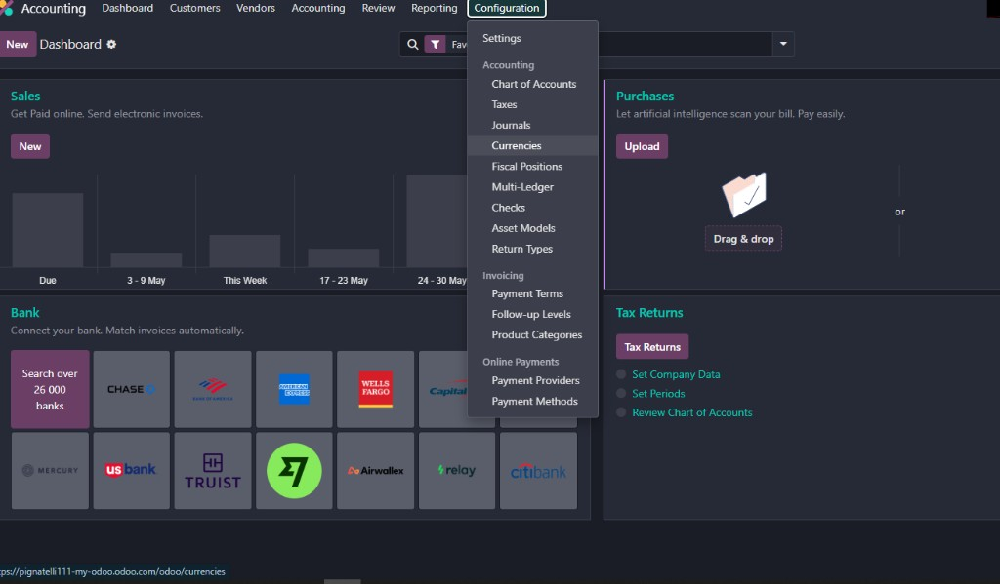

# Guida test autonomo — Odoo SBU per Cosimo

**Per chi non ha mai usato Odoo**  
**Cliente:** Suburban SRL  
**Ambiente:** https://pignatelli111-my-odoo.odoo.com  
**Versione guida:** 1.0 — maggio 2026  

Questa guida ti permette di **testare da solo** tutto il flusso SBU (preventivo → commessa → acquisti → magazzino → SAL → banca), **passo dopo passo**, con **cosa cliccare**, **cosa devi vedere** e **come segnalare un bug**.

Le foto sotto sono **screenshot reali** dell’ambiente di sviluppo/UAT. Se la tua schermata è diversa, fai uno screenshot e allegalo al bug.

---

## Indice

1. [Cos’è Odoo in 2 minuti](#1-cosè-odoo-in-2-minuti)
2. [Accedere e scegliere l’azienda giusta](#2-accedere-e-scegliere-lazienda-giusta)
3. [Le 5 cose da sapere sull’interfaccia](#3-le-5-cose-da-sapere-sullinterfaccia)
4. [Aprire il menu SBU](#4-aprire-il-menu-sbu)
5. [Test 1 — Creare un preventivo a mano](#5-test-1--creare-un-preventivo-a-mano)
6. [Test 2 — Importare Excel ANACO](#6-test-2--importare-excel-anaco)
7. [Test 3 — Distinta base (perdita % e MOQ)](#7-test-3--distinta-base-perdita--e-moq)
8. [Test 4 — Voci SAL e percentuali](#8-test-4--voci-sal-e-percentuali)
9. [Test 5 — Vinto e creare la commessa](#9-test-5--vinto-e-creare-la-commessa)
10. [Test 6 — Documenti OneDrive sulla commessa](#10-test-6--documenti-onedrive-sulla-commessa)
11. [Test 7 — Richiesta acquisto (RDA)](#11-test-7--richiesta-acquisto-rda)
12. [Test 8 — Ordine, ricevimento, DDT](#12-test-8--ordine-ricevimento-ddt)
13. [Test 9 — Foglio SAL, fattura, CDP](#13-test-9--foglio-sal-fattura-cdp)
14. [Test 10 — Movimenti Qonto](#14-test-10--movimenti-qonto)
15. [Test 11 — Chiusura commessa](#15-test-11--chiusura-commessa)
16. [Scheda bug da compilare](#16-scheda-bug-da-compilare)
17. [Checklist finale](#17-checklist-finale)

---

## 1. Cos’è Odoo in 2 minuti

Odoo è un programma **nel browser** (Chrome o Edge). Non si installa sul PC.

- Ogni **record** è una scheda: un preventivo, una commessa, un ordine.
- I record si aprono in **lista** (tante righe) o in **scheda** (un solo documento).
- Quasi sempre devi **salvare** dopo le modifiche (pulsante **Salva** in alto, spesso icona nuvola).
- Il menu **SBU** contiene il lavoro Suburban; il resto dei menu (Contabilità, Magazzino, …) serve per passi successivi.

**Non usare** URL con `dev.odoo.com` per dati veri: solo produzione  
`https://pignatelli111-my-odoo.odoo.com`

---

## 2. Accedere e scegliere l’azienda giusta

### Passo 2.1 — Login

1. Apri il browser.
2. Vai su: **https://pignatelli111-my-odoo.odoo.com**
3. Inserisci **email** e **password** che ti hanno dato.
4. Clicca **Accedi** / **Log in**.

**Devi vedere:** la pagina iniziale con molti riquadri colorati (le “app”).

### Passo 2.2 — Azienda corretta (importantissimo)

In alto a destra c’è spesso il nome dell’**azienda** (es. *My Company* / *Suburban*).

1. Clicca sul nome azienda.
2. Seleziona l’azienda **Suburban** (o quella che vi hanno indicato).
3. Se non selezioni l’azienda giusta, compare un errore di accesso ai preventivi.


**Bug se:** dopo il login non vedi nessun menu o messaggio “accesso negato” / multiazienda → screenshot + nome azienda selezionata.

---

## 3. Le 5 cose da sapere sull’interfaccia

| Elemento | Dove | A cosa serve |
|----------|------|----------------|
| **Griglia app** (9 puntini o home) | Alto a sinistra | Torna alla scelta app (SBU, Magazzino, …) |
| **Menu a sinistra** | Barra laterale dentro un’app | Voci tipo Preventivi, Jobs, … |
| **Nuovo** | In alto nella lista | Crea un record nuovo |
| **Salva** | In alto nella scheda | Memorizza le modifiche |
| **Breadcrumb** | Sotto la barra viola | Es. SBU / Preventivi / PRV/2026/0004 |

**Regola:** se modifichi un campo e cambi pagina **senza salvare**, le modifiche si perdono. Odoo a volte avvisa “Vuoi salvare?”.

---

## 4. Aprire il menu SBU

1. Dalla home, clicca il riquadro **SBU** (icona / nome SBU).
2. A sinistra compare il menu SBU.


**Voci che userai spesso** (alcune etichette possono essere in inglese):

| Menu | Nome in schermata | Uso |
|------|-------------------|-----|
| Preventivi → Tutti i Preventivi | Italiano | Preventivi / ANACO |
| Jobs | Inglese | Commesse (cantieri) |
| Purchasing → Purchase requests | Inglese | Richieste acquisto RDA |
| Billing → SAL sheets | Inglese | Fogli SAL |
| (da Contabilità) Movimenti Qonto | Italiano/inglese | Banca |

**Bug se:** non compare il riquadro SBU → modulo non installato: vedi sezione 4.1.

### 4.1 — Dopo un aggiornamento software (solo se ti dicono “c’è un nuovo rilascio”)

1. Griglia app → **App** (Applicazioni).
2. Cerca `sbu_estimate` (o altro modulo SBU).
3. Menu ⋮ sulla scheda → **Aggiorna** / **Upgrade**.


Ripeti per: `sbu_estimate`, `sbu_purchase_flow`, `sbu_sal`, `sbu_stock_config`, `sbu_qonto`, `sbu_documents` se usati.

---

## 5. Test 1 — Creare un preventivo a mano

**Obiettivo:** capire la scheda preventivo senza Excel.

### Passi

1. **SBU** → **Preventivi** → **Tutti i Preventivi**.
2. Clicca **Nuovo** (in alto a sinistra nella lista).
3. Compila:
   - **Cliente** (cerca e seleziona un cliente di test).
   - **Cantiere / immobile** (testo libero, es. `Via Roma 1 – TEST`).
   - **Responsabile** (il tuo utente, se c’è il campo).
4. Clicca **Salva**.
5. In alto compare il **numero preventivo** (es. `PRV/2026/0010`). Annotalo.


6. Apri il tab **Righe Preventivo (ANACO)**.
7. In fondo alla tabella righe, clicca **Aggiungi una riga** (o icona +).
8. Compila almeno:
   - **Pos.** es. `FT-TEST`
   - **Descrizione** es. `Finestra test`
   - **Qt.** es. `2`
   - **B (mm)** es. `1200`
   - **H (mm)** es. `1400`
9. **Salva** il preventivo.

**Devi vedere:** la riga in elenco; i campi **Mq tot.** e totali in testata che si aggiornano (dopo salvataggio).

**Bug se:** non riesci a salvare, campi rossi, totali sempre zero con B/H e Qt. compilati.

---

## 6. Test 2 — Importare Excel ANACO

**Obiettivo:** caricare il file Excel come oggi in ANACO.

### Prima dell’import (su Excel)

1. Apri il file `ANACO_REVx_….xlsx` in **Excel**.
2. Controlla che ci siano dati su foglio **ANACO** e/o **OFFERTA** e/o **Voci Contrattuali_SAL**.
3. **File → Salva** (obbligatorio: Odoo legge i valori salvati, non le formule aperte).

### In Odoo

1. Apri il preventivo di test (quello creato sopra o un pilota).
2. Clicca **Importa Excel ANACO** (in alto nella scheda).
3. Nella finestra:
   - **Scegli file** → seleziona il `.xlsx`.
   - Spunta **Importa righe ANACO** (se vuoi le righe costo).
   - Spunta **Importa Voci Contrattuali SAL** (se il foglio SAL è compilato).
   - Prima import: spunta **Sostituisci righe esistenti**.
   - Lascia attivi: **Rileva automaticamente prima riga ANACO** e **Se ANACO vuoto, importa da foglio OFFERTA**.
4. Clicca **Importa**.

**Devi vedere:** messaggio di successo con numero righe importate; nel tab **Righe Preventivo** compaiono le righe.

### Se compare errore “Nessuna riga ANACO importata”


**Prova in ordine:**

1. Excel → **Salva** → ripeti import.
2. Lascia attive le due opzioni automatiche (prima riga + OFFERTA).
3. Se il file è solo modello vuoto, è **normale** che non importi nulla: prova un file con dati veri.

**Bug se:** file con dati visibili in Excel e zero righe in Odoo dopo Salva → allega il file (o una riga screenshot) + screenshot wizard.

---

## 7. Test 3 — Distinta base (perdita % e MOQ)

**Obiettivo:** verificare il calcolo **Quantità da ordinare** e **Costo totale** sulla distinta (foglio ITEM).

Usa il preventivo con riga **FT-TEST** (Qt. = 10) oppure creala come al Test 1.

### Passo 7.1 — Aprire la distinta

1. Apri il preventivo.
2. Tab **Righe Preventivo (ANACO)** → apri la riga (clic sulla riga o icona modifica).
3. Dentro la riga, tab **Distinta Base (ITEM)**  
   **Oppure** tab **Distinta Base (ITEM)** sul preventivo (tutte le righe).

### Passo 7.2 — Caso A: Perdita demand 10%

1. **Aggiungi una riga** distinta.
2. **Prodotto:** scegli un prodotto di test (es. vite / profilo UAT se presente).
3. Imposta:
   - **Tipo calcolo:** `A Pezzo (Nr/Pz)`
   - **Fattore formula:** `4`
   - **Confezione minima:** `0`
   - **Perdita demand %:** `10`
   - **MOQ demand:** `0`
   - **Costo unitario:** `0,80`
4. **Salva**.

**Calcolo atteso (Cosimo):**

- Quantità teorica = 4 × 10 pezzi = **40**
- Quantità da ordinare = 40 × 1,10 = **44**
- Costo totale = 44 × 0,80 = **35,20**

**Bug se:** vedi 40 e 32,00 invece di 44 e 35,20.

### Passo 7.3 — Caso B: MOQ 25

Nuova riga distinta (o modifica):

- **Fattore formula:** `1`
- **Perdita demand %:** `0`
- **MOQ demand:** `25`
- **Costo unitario:** `2,00`
- Qt. riga preventivo sempre **10**

**Atteso:**

- Teorica **10** → da ordinare **25** → costo totale **50,00**

**Bug se:** vedi 10 e 20,00.

### Cosa scrivere nel bug

> Test 3 distinta — perdita/MOQ: atteso 44 / 35,20 (o 25 / 50), ottenuto …  
> Preventivo: PRV/… , riga FTF-01, screenshot tab distinta.

---

## 8. Test 4 — Voci SAL e percentuali

**Obiettivo:** confermare che **SAL-1 … SAL-10** sono le **quote di ogni singolo SAL** (es. mensile) e che **insieme non superano 100%**.

Come hai confermato: *«il SAL è la cifra per cui chiediamo approvazione, spesso mensile»* — ogni colonna SAL-n è **una richiesta**, non il cumulato precedente.

### Passi

1. Apri il preventivo.
2. Tab **Voci Contrattuali SAL**.
3. **Aggiungi una riga** voce contrattuale:
   - **Descrizione** es. `SAL avanzamento lavori`
   - **Q.tà contrattuale** `1`
   - **Importo unitario** es. `100000` (centomila € contratto)
4. Nella stessa riga, compila solo:
   - **SAL-1 %** = `10`
   - **SAL-2 %** = `30`
   - **SAL-3 %** = `40`
5. **Salva**.


**Devi vedere:**

- **Avanzamento cumulativo %** = 10+30+40 = **80**
- **Fatturato pianificato (SAL %)** ≈ 80.000 € (80% di 100.000)
- **Residuo (vs piano SAL)** ≈ 20.000 €

6. Prova a mettere SAL-4 % = `30` (totale 110%) e **Salva**.

**Devi vedere:** messaggio di errore che **blocca** il salvataggio (somma > 100%).

**Bug se:**

- La somma supera 100% e Odoo salva comunque.
- Il “pianificato” non è contratto × somma delle %.
- Non trovi le colonne SAL-1 … SAL-10: in lista colonne clicca l’icona **colonne** (slitta) e attivale.

**Nota:** qui stai facendo il **piano** sul preventivo. Il **SAL vero** (fattura del mese) si fa dopo sul **foglio SAL** in commessa (Test 9).

---

## 9. Test 5 — Vinto e creare la commessa

**Obiettivo:** da preventivo accettato → progetto cantiere.

### Passi

1. Apri il preventivo di test (stato **Bozza** o **Inviato**).
2. Clicca il pulsante verde **Vinto** in alto.
3. Si apre la finestra **Crea Commessa da Preventivo**:
   - Controlla **Codice commessa** (es. `P0007_2026`).
   - **Nome commessa** (puoi lasciare o modificare).
4. Clicca **Crea Commessa**.

**Devi vedere:** si apre la **scheda commessa** (progetto) collegata.


5. Dal preventivo, il pulsante / collegamento **Commessa** deve aprire lo stesso progetto.
6. Menu **SBU → Jobs** → nella lista deve comparire la commessa.

**Bug se:** Vinto senza wizard; commessa senza preventivo; doppia commessa sullo stesso preventivo.

---

## 10. Test 6 — Documenti OneDrive sulla commessa

**Obiettivo:** registrare dove sta la cartella documenti (OneDrive resta fuori Odoo).

### Passi

1. Apri la commessa (da **Jobs** o dal preventivo).
2. Cerca il tab **Document hub** (hub documenti).
3. Compila:
   - **OneDrive folder URL** — incolla il link della cartella SharePoint/OneDrive.
   - **Custode documenti** — nome persona che gestisce accessi.
   - **Nota accesso** — come entrare (account M365, no password in chiaro se possibile).
4. **Salva**.

**Devi vedere:** i campi salvati; la cartella **non** si apre dentro Odoo (solo link).

**Bug se:** errore JavaScript incollando link lunghi → incolla URL nel campo testo semplice e metti istruzioni in **Nota accesso**.

**Non fare screenshot** con password Qonto/API in chiaro.

---

## 11. Test 7 — Richiesta acquisto (RDA)

**Obiettivo:** creare una richiesta materiali dalla distinta.

**Nota lingua:** menu **Purchasing** → **Purchase requests** (inglese).

### Passi

1. Assicurati che il preventivo sia **Vinto** e che la distinta (Test 3) abbia almeno una riga.
2. Apri la **commessa** → cerca pulsante / contatore **Purchase req.** (richieste acquisto) e aprilo  
   **Oppure:** **SBU → Purchasing → Purchase requests → Nuovo**.
3. Compila:
   - **Project** / commessa = la tua commessa di test.
   - **Estimate** / preventivo se richiesto.
4. Clicca **Add lines from estimate BOM** (aggiungi righe da distinta).
5. Tab **Lines**: controlla **Quantity** (deve essere coerente con distinta, es. 44 nel caso perdita 10%).
6. **Salva**.
7. Clicca **Submit** → poi **Approve** (se il tuo utente può approvare).
8. Opzionale: **Create draft RFQ(s)** per generare bozza ordine fornitore.

**Bug se:** quantità RDA diversa da “Quantità da ordinare” in distinta; impossibile collegare commessa.

**Pilota di riferimento:** RDA `RDA/26/0002`, commessa `P0006_2026`.

---

## 12. Test 8 — Ordine, ricevimento, DDT

**Obiettivo:** ricevere merce e stampare DDT.

Serve un **ordine acquisto** confermato sulla commessa (dal Test 7 o pilota **P00001**).

### Passi

1. **Acquisti** (menu Odoo standard) o da commessa tab **Logistics** → **Purchase orders**.
2. Apri l’ordine → **Conferma** se è bozza.
3. Clicca il pulsante **Ricevimento** / **Receipt** (trasferimento in entrata).
4. Sul ricevimento verifica campo **Progetto / Job** = commessa corretta.
5. Inserisci quantità ricevute → **Valida** / **Validate**.
6. Tab **DDT / transport** (se presente): vettore, targa (opzionale).
7. Pulsante **Print DDT (SBU)** → si scarica PDF con numero `DDT/AAAA/…`.

**Devi vedere:** ricevimento in stato **Fatto**; su commessa tab **Logistics** il collegamento aggiornato.

**Bug se:** ricevimento senza commessa; DDT senza numero; PDF vuoto.

---

## 13. Test 9 — Foglio SAL, fattura, CDP

**Obiettivo:** simulare l’approvazione/fatturazione di un avanzamento (il “SAL mensile”).

Menu: **SBU → Billing → SAL sheets** → **Nuovo**.

### Passi

1. **Project** = commessa di test.
2. **Salva** — si assegna codice es. `SAL/2026/0001`.
3. Tab **Lines** → aggiungi riga:
   - Collega **voce contrattuale SAL** del preventivo.
   - Imposta **% SAL corrente** o importo di questo periodo.
4. **Salva** → clic **Confirm**.
5. Opzionale (se avete contabilità di test):
   - **Customer invoice** — crea fattura bozza.
   - **Payment certificate** — certificato di pagamento (CDP).
6. Torna al **preventivo** → tab **Voci Contrattuali SAL** → controlla **Fatturato ad oggi** / **Residuo**.

**Devi vedere:** dopo conferma/fattura, i totali sul preventivo si aggiornano (se modulo SAL installato e collegato).

**Bug se:** foglio SAL confermato ma preventivo con fatturato ancora zero; CDP duplicati.

**Distinzione:** modificare SAL-1 % sul preventivo **non** sostituisce un foglio SAL già fatturato — sono due fasi (piano vs reale).

---

## 14. Test 10 — Movimenti Qonto

**Obiettivo:** vedere movimenti banca e collegamento (non riconciliazione completa).

### Configurazione (una tantum, con amministratore)

1. **Impostazioni** (ingranaggio) → **Aziende** → apri azienda Suburban.
2. Tab **Qonto (SBU)** — API login, secret, IBAN, attiva cron import.


**Non** usare Contabilità → “Collega la tua banca → Qonto” standard se non avete abbonamento Odoo Enterprise banca.

### Uso quotidiano (test)

1. Menu **Contabilità** → **Movimenti Qonto** (o voce simile SBU Qonto).
2. Attendi import automatico **oppure** da impostazioni **Import now**.
3. Seleziona un movimento → **Suggest match** → controlla suggerimento fattura/pagamento.
4. Se corretto: **Match** o **Apply suggestion**; altrimenti **Ignore**.

**Bug se:** nessun movimento dopo 24h con cron attivo; match completamente sbagliato su importo e riferimento uguali.

---

## 15. Test 11 — Chiusura commessa

**Obiettivo:** Odoo deve impedire chiusura se mancano documenti in checklist.

1. Apri commessa di test.
2. Tab **SBU** o stato commessa → imposta **In chiusura** (se il campo **sbu_state** è visibile).
3. Compare checklist documenti (DOP, ecc.).
4. Lascia una voce obbligatoria **non** completata → prova **Chiusa** / **Archiviata**.

**Devi vedere:** **messaggio di blocco**.

5. Segna tutte le voci **Done** / **N/A** → ora la chiusura deve essere consentita.

**Bug se:** chiusura consentita con checklist incompleta.

---

## 16. Scheda bug da compilare

Copia per ogni problema:

```text
DATA: 
ORA: 
TUO UTENTE (email): 

TEST NUMERO (dalla guida): es. Test 3
PREVENTIVO: es. PRV/2026/0010
COMMESSA: es. P0007_2026

PASSI FATTI (1, 2, 3…):
1. 
2. 
3. 

RISULTATO ATTESO:


RISULTATO OTTENUTO:


SCREENSHOT ALLEGATI (sì/no):


FILE EXCEL (se import ANACO): 
```

Invia a: [inserire email referente tecnico]

---

## 17. Checklist finale

Segna ✅ quando hai fatto il test senza aiuto.

| # | Test | OK | Note / bug |
|---|------|----|------------|
| 2 | Login + azienda Suburban | ☐ | |
| 5 | Preventivo manuale + riga ANACO | ☐ | |
| 6 | Import Excel ANACO | ☐ | |
| 7 | Distinta perdita 10% → 44 | ☐ | |
| 7 | Distinta MOQ 25 → 25 | ☐ | |
| 8 | SAL % somma ≤ 100% | ☐ | |
| 9 | Vinto → commessa | ☐ | |
| 10 | Link OneDrive su commessa | ☐ | |
| 11 | RDA da distinta | ☐ | |
| 12 | Ricevimento + DDT | ☐ | |
| 13 | Foglio SAL + aggiornamento preventivo | ☐ | |
| 14 | Movimento Qonto + match | ☐ | |
| 15 | Chiusura bloccata se checklist aperta | ☐ | |

---

## Riferimenti utili

| Documento | Contenuto |
|-----------|-----------|
| [GUIDA_UTENTE_SBU_ODOO.md](GUIDA_UTENTE_SBU_ODOO.md) | Manuale utente completo |
| Pilota UAT | PRV/2026/0004, P0006_2026, RDA/26/0002, PO P00001 |
| Moduli da aggiornare | `sbu_estimate` 52+, `sbu_purchase_flow` 19+ |

---

## Impostazioni SBU (solo se ti serve capire integrazioni)




---

*Guida per test autonomo Suburban — aggiornare screenshot man mano che l’UI evolve.*
