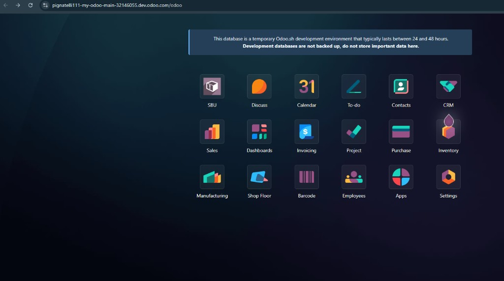
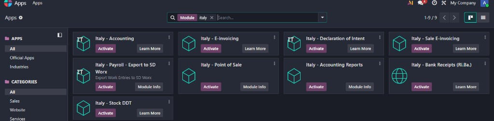
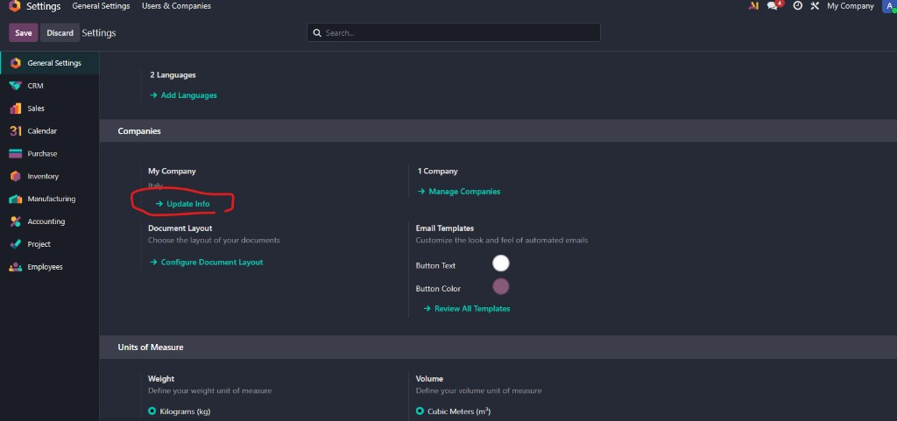
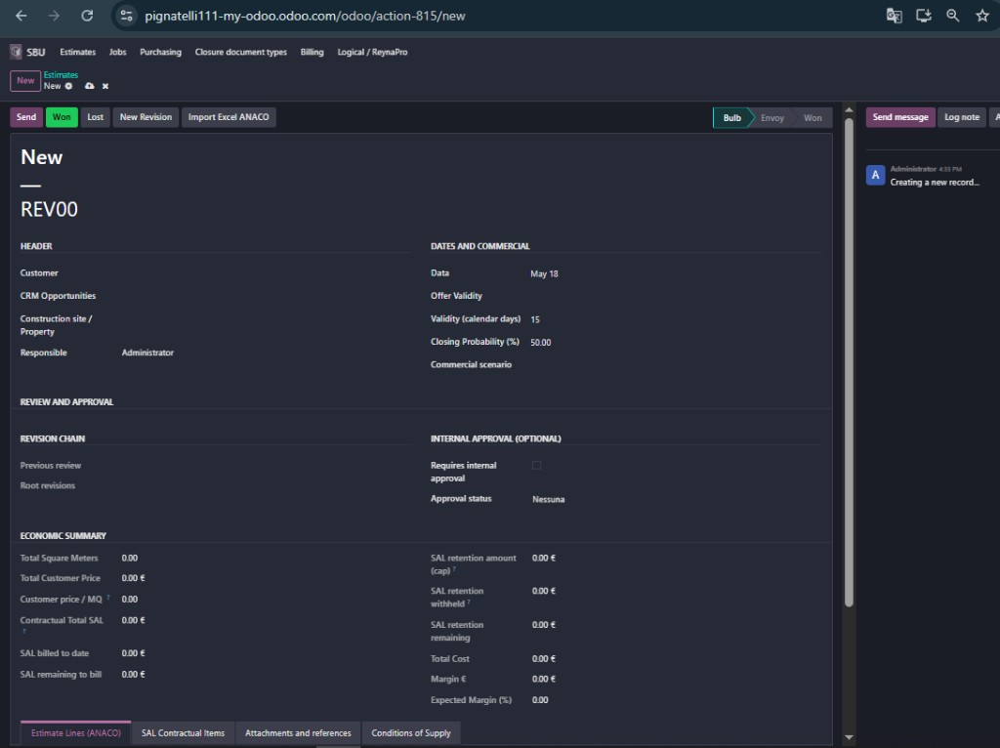
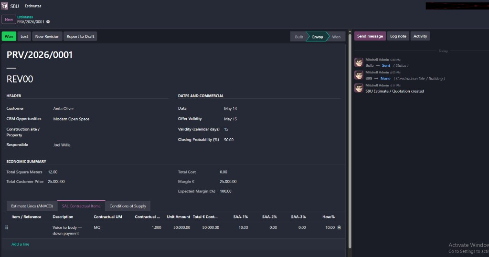
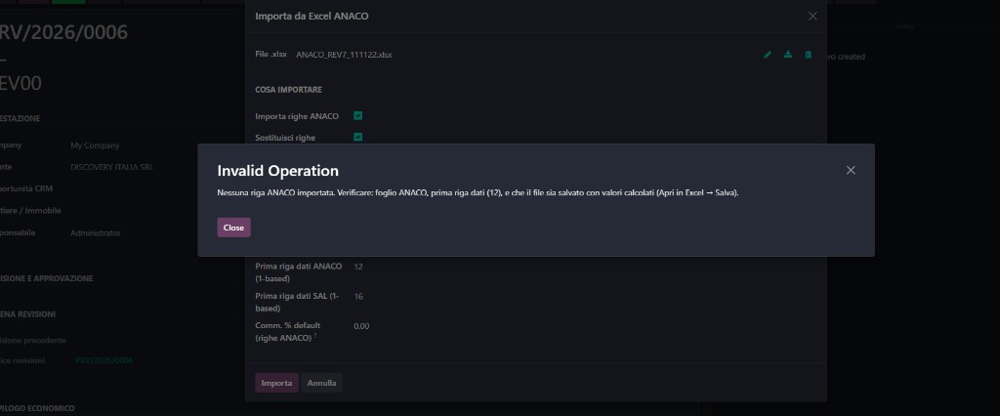
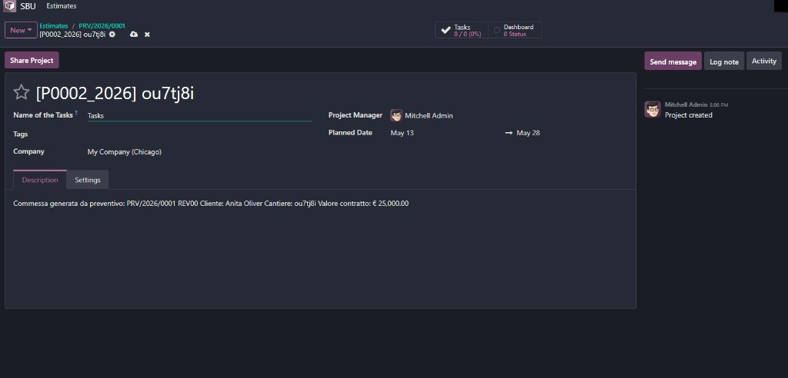
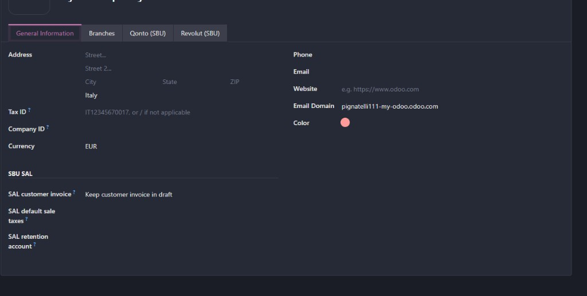
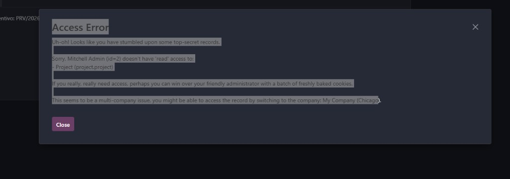

# Guida utente — Piattaforma SBU su Odoo 19

**Cliente:** Suburban SRL a Socio Unico  
**Versione guida:** 1.0 — maggio 2026  
**Ambiente operativo:** https://pignatelli111-my-odoo.odoo.com  
**Lingua interfaccia:** italiano (consigliato); è possibile aggiungere l’inglese in **Impostazioni → Lingue**

---

## A chi è rivolta questa guida

Questa guida spiega come usare **Odoo come unico front-office** per il flusso Suburban: dal **preventivo ANACO** alla **commessa**, agli **acquisti**, al **SAL**, ai **documenti** (OneDrive/SharePoint), alla **logistica** e al collegamento con **Qonto**.

Non serve un cruscotto esterno: tutto avviene dentro Odoo, nel menu **SBU**.

---

## Indice

1. [Primi passi](#1-primi-passi)
2. [Preventivo (ex foglio ANACO)](#2-preventivo-ex-foglio-anaco)
3. [Import Excel ANACO](#3-import-excel-anaco)
4. [Vinto → commessa](#4-vinto--commessa)
5. [Acquisti (RDA, RFQ, ordini)](#5-acquisti-rda-rfq-ordini)
6. [Documenti e OneDrive](#6-documenti-e-onedrive)
7. [SAL, fatture e certificati di pagamento](#7-sal-fatture-e-certificati-di-pagamento)
8. [Logistica e DDT](#8-logistica-e-ddt)
9. [Qonto (movimenti banca)](#9-qonto-movimenti-banca)
10. [Logikal / ReynaPro (opzionale)](#10-logikal--reynapro-opzionale)
11. [Chiusura commessa](#11-chiusura-commessa)
12. [Problemi frequenti](#12-problemi-frequenti)
13. [Glossario](#13-glossario)

---

## 1. Primi passi

### 1.1 Accedere a Odoo

1. Aprire il browser e andare su: **https://pignatelli111-my-odoo.odoo.com**
2. Inserire **email** e **password** fornite dall’amministratore.
3. Dalla **home** (griglia applicazioni), aprire il riquadro **SBU**.



> **Nota:** L’ambiente di **sviluppo** Odoo.sh (URL con `dev.odoo.com`) è temporaneo e non va usato per dati reali. Usare sempre l’URL di **produzione** sopra.

### 1.2 Menu SBU

| Menu | Uso |
|------|-----|
| **SBU → Preventivi** | Creare e gestire preventivi / revisioni |
| **Progetti** (da commessa) | Cantiere, SAL, documenti, logistica |
| **Acquisti** | RDA, richieste di preventivo, ordini fornitore |
| **Fatturazione / SAL** | Fogli SAL, CDP |
| **Magazzino** | Ricevimenti, DDT, trasferimenti |
| **Contabilità → Movimenti Qonto** | Mirror movimenti banca |

### 1.3 Moduli da avere installati (amministratore)

Dopo ogni aggiornamento software, in **App** cercare e **aggiornare** i moduli `sbu_*` (es. `sbu_estimate`, `sbu_purchase_flow`, `sbu_sal`, `sbu_documents`, `sbu_stock_config`, `sbu_qonto`).



### 1.4 Impostazioni SBU (solo referenti / IT)

**Impostazioni → Generali** → scorrere fino al blocco **SBU** (Graph, OneDrive, Logikal, Qonto).



---

## 2. Preventivo (ex foglio ANACO)

### 2.1 Creare un preventivo

1. **SBU → Preventivi → Tutti i Preventivi → Nuovo**
2. Compilare l’intestazione:
   - **Cliente**
   - **Cantiere / immobile**
   - **Opportunità CRM** (opzionale)
   - **Responsabile**
3. Salvare: Odoo assegna il numero (es. `PRV/2026/0006`).



### 2.2 Righe preventivo (tab *Righe Preventivo ANACO*)

Per ogni posizione (serramento, vetro, accessorio, …):

| Campo | Significato (come in Excel) |
|-------|-----------------------------|
| **Pos. / Codice** | Codice item (FT, LA01, …) |
| **Descrizione** | Testo offerta |
| **B (mm), H (mm), Qt.** | Dimensioni e quantità |
| **U.M. calcolo** | MQ, ML, Nr-Pz, a corpo |
| **Colonne prezzo/costo CAD** | Listini componenti |
| **Prezzo unit. ANACO (BS)** | Prezzo unitario finale da Excel (se usato) |
| **Sconti 1–3, Comm. %** | Catena sconti sul listino |
| **Categoria / famiglia costo** | Per workflow acquisti (VC, ST, PAN, …) |

I totali in alto (**Mq tot.**, **Prezzo cliente**, **Costo**, **Margine**) si aggiornano automaticamente.

### 2.3 Distinta base (tab *Distinta Base*)

Per ogni riga ANACO si possono aggiungere componenti (profili, viti, vetri) con quantità e costo.  
Da qui, in seguito, si generano le **RDA** verso fornitori.

### 2.4 Voci contrattuali SAL (tab *Voci Contrattuali SAL*)

Qui si definiscono le voci con cui si fatturerà il cliente (acconti, avanzamenti, SAL-1 … SAL-10).



| Campo | Uso |
|-------|-----|
| **Q.tà contrattuale / Importo unitario** | Valore contrattuale |
| **SAL-1 … SAL-10 %** | Percentuali di avanzamento pianificate |
| **Righe preventivo collegate** | Collegamento alle righe ANACO di supporto |
| **Fatturato ad oggi / Residuo** | Aggiornati dai fogli SAL confermati |

### 2.5 Stati del preventivo

| Stato | Significato |
|-------|-------------|
| **Bozza** | In lavorazione |
| **Inviato** | Inviato al cliente |
| **Vinto** | Commessa da aprire |
| **Perso** | Archiviato commercialmente |

Pulsanti in testata: **Invia**, **Vinto**, **Perso**, **Nuova revisione**, **Importa Excel ANACO**.

---

## 3. Import Excel ANACO

Usare l’import per **ridurre la digitazione** dal file `ANACO_REVx_….xlsx`, non per sostituire il controllo tecnico-commerciale.

### 3.1 Prima dell’import

1. Aprire il file in **Microsoft Excel**.
2. Verificare che esistano i fogli **ANACO** e/o **Voci Contrattuali_SAL** (e opzionalmente dati su **OFFERTA**).
3. **Salvare** il file (importante: Excel deve memorizzare i **valori calcolati**, non solo le formule).
4. Sul preventivo in Odoo: **Importa Excel ANACO**.

### 3.2 Opzioni del wizard

| Opzione | Consiglio |
|---------|-----------|
| **Importa righe ANACO** | Sì, per le righe costo/prezzo |
| **Importa Voci Contrattuali SAL** | Sì, se il foglio SAL è compilato |
| **Sostituisci righe esistenti** | Sì la prima volta; attenzione se avete già modificato in Odoo |
| **Rileva automaticamente prima riga ANACO** | Lasciare attivo |
| **Se ANACO vuoto, importa da foglio OFFERTA** | Lasciare attivo (molti file hanno solo la griglia OFFERTA compilata) |
| **Prima riga dati ANACO** | Default **12** per REV7; cambiare solo se il file è diverso |
| **Comm. % default** | Solo se in Excel non avete la commissione per riga |

### 3.3 Dopo l’import

- Controllare tab **Righe ANACO** e **Voci SAL**.
- Verificare totali (**Mq**, **Prezzo cliente**, **Costo**) rispetto al file Excel.
- Correggere note, famiglie costo e distinta a mano se serve.

### 3.4 Se compare “Nessuna riga ANACO importata”



**Cause tipiche:**

1. File **non salvato** da Excel dopo l’ultima modifica.
2. Foglio **ANACO** senza dati in Pos./Descr. **e** senza dimensioni/prezzi (file modello vuoto).
3. Dati solo sul foglio **OFFERTA** → attivare **import da OFFERTA** (versione modulo **50+**).
4. **Prima riga dati** errata → usare rilevamento automatico o provare riga **11** o **24**.

**Cosa fare:**  
Aprire Excel → **Salva** → ripetere import con le due opzioni automatiche attive. Se persiste, inviare all’assistenza una riga di esempio (screenshot + file).

---

## 4. Vinto → commessa

1. Sul preventivo **Vinto**, usare il wizard **Crea commessa** (o pulsante equivalente sul preventivo).
2. Confermare codice commessa (es. `P0006_2026`) e date.
3. Si apre il **progetto Odoo** collegato.



Sulla commessa trovate:

- Riferimento al preventivo e al cliente
- Tab **Documenti** (hub OneDrive)
- Tab **Logistics** (ricevimenti, DDT)
- Collegamenti a **SAL** e **acquisti**

---

## 5. Acquisti (RDA, RFQ, ordini)

### 5.1 Flusso consigliato

```text
Preventivo (distinta / famiglia costo)
    → Richiesta di acquisto (RDA)
    → Bozze RFQ / confronto fornitori
    → Ordine di acquisto (PO) con commessa collegata
    → Ricevimento magazzino
```

### 5.2 Da preventivo

- Tab **Distinta Base** → azione per creare **RDA** (o da commessa: richieste per route VC/VS, ST, PAN, …).

### 5.3 Su ordine acquisto

- Campo **Commessa / Job**: sempre valorizzato → il ricevimento eredita la commessa.
- Se il totale ordine supera il budget preventivo (>5%), compare un **avviso** in testata.

---

## 6. Documenti e OneDrive

### Perché OneDrive resta esterno

I disegni, PDF, DOP e cartelle cantiere restano su **Microsoft 365 / OneDrive** (come oggi). Odoo memorizza:

- **Link** alla cartella SharePoint/OneDrive
- **Custode** (chi gestisce accessi/password guest)
- **Note accesso** (istruzioni per colleghi e fornitori)

### Su commessa — tab Documenti

1. Incollare l’**URL** della cartella progetto.
2. Indicare il **custode documenti**.
3. Compilare **nota accesso** (es. “password guest su link M365”, non la password in chiaro se non policy aziendale).

> **Processo consigliato:** cartella aziendale su SharePoint **senza** password guest quando possibile; accesso con account M365 Suburban.

---

## 7. SAL, fatture e certificati di pagamento

### 7.1 Foglio SAL su commessa

1. Aprire la **commessa**.
2. Creare **Foglio SAL** (SAL01, SAL02, …).
3. Aggiungere righe collegate alle **voci contrattuali** del preventivo.
4. Confermare il foglio → generazione **fattura cliente** e/o **certificato di pagamento (CDP)**.

### 7.2 Garanzia (ritenute)

Le percentuali di **ritenuta** sulle voci contrattuali del preventivo alimentano i calcoli di garanzia sui SAL.

### 7.3 Aggiornamento preventivo

Dopo fatturazione/CDP, sul preventivo (tab SAL) si vedono **fatturato**, **residuo** e riferimenti documento.

---

## 8. Logistica e DDT

### 8.1 Ricevimento merce da ordine acquisto

1. Confermare **ordine acquisto** collegato alla commessa.
2. Aprire il **ricevimento** (Incoming) dalla PO o da **Commessa → Logistics → Open receipts**.
3. Verificare **Job / project** = commessa corretta.
4. **Validare** le quantità (eventuale secondo step Input → Magazzino se attivo).

### 8.2 Stampa DDT (documento di trasporto)

Sul trasferimento validato:

- Tab **DDT / transport** → eventuale vettore, targa, causale.
- Pulsante **Print DDT (SBU)** → PDF con numero **DDT/AAAA/####**.

### 8.3 Consegna a cantiere

Su ricevimento completato o da commessa: **Deliver stock to site** → trasferimento interno verso ubicazione **SBU / Site (cantiere)**.

---

## 9. Qonto (movimenti banca)

### Perché non usare “Collega la banca → Qonto” di Odoo standard

Suburban usa il modulo **SBU Qonto** (scheda azienda), non il connettore Enterprise generico.

### 9.1 Configurazione (amministratore)

**Impostazioni → Aziende → [Azienda] → tab Qonto (SBU)**



| Campo | Dove trovarlo in Qonto |
|-------|-------------------------|
| **Qonto API login** | Qonto → Impostazioni → **Codice API** → “Accedi” (es. `suburban-srl-xxxx`) |
| **Secret key** | Stesso schermo → “Codice segreto” |
| **IBAN** | Conto corrente usato per l’API |
| **Sandbox** | Solo per test |
| **Enable Qonto import cron** | Attiva import orario su Odoo |
| **Webhook token** | Stringa segreta scelta da voi; URL: `https://pignatelli111-my-odoo.odoo.com/qonto/webhook/<token>` |

> **Sicurezza:** non condividere il codice segreto API. Rigenerarlo su Qonto invalida la vecchia chiave.

### 9.2 Uso quotidiano

**Contabilità → Movimenti Qonto**

1. Import automatico (cron) o **Import now** da impostazioni.
2. Su ogni movimento: **Suggest match** → suggerimento pagamento/fattura.
3. **Match (high confidence)** solo se sicuri; altrimenti **Apply suggestion** dopo controllo.
4. **Ignore** per commissioni/spese non collegate.

Odoo **non** sostituisce ancora la riconciliazione contabile completa: è un aiuto per collegare SAL e incassi.

---

## 10. Logikal / ReynaPro (opzionale)

Il file **SQLite** Logikal **non** si apre direttamente in Odoo.

| Metodo | Passi |
|--------|--------|
| **CSV/JSON** | Logikal → export → **Logikal → Import** in Odoo |
| **API** (se Fonatto/IT attiva bridge) | Impostazioni SBU → URL API Logikal |

Le dimensioni tecniche possono essere applicate alle righe distinta (evoluzione in corso).

---

## 11. Chiusura commessa

1. Portare la commessa in stato **In chiusura**.
2. Compilare la **checklist documenti** (DOP, certificati, …).
3. Solo quando tutto è OK: stato **Chiusa** / **Archiviata**.

Odoo **blocca** la chiusura se mancano documenti obbligatori.

---

## 12. Problemi frequenti

### Errore accesso / “multi-company”



**Soluzione:** in alto a destra, selezionare l’azienda corretta (es. **Suburban / My Company**). Ripetere l’operazione.

### Non vedo Opportunità CRM sul preventivo

Serve profilo **SBU Estimate User** o **Vendite / Utente**. Chiedere all’amministratore di aggiornare i diritti (modulo `sbu_estimate` 47+).

### Errore JavaScript ogni pochi secondi su link SharePoint

Non usare il widget “link” su URL lunghi con password; usare campo testo + **nota accesso** (fix `sbu_documents` 9+).

### Import ANACO zero righe

Vedi [§3.4](#34-se-compare-nessuna-riga-anaco-importata). Aggiornare `sbu_estimate` alla versione **50** o superiore.

### Build / modulo non aggiornato

Dopo deploy su Odoo.sh: **App → Aggiorna elenco app →** cercare `sbu_…` → **Aggiorna**.

---

## 13. Glossario

| Termine | Significato |
|---------|-------------|
| **ANACO** | Foglio Excel storico di analisi e preventivo |
| **Preventivo** | Documento commerciale in Odoo (`sbu.estimate`) |
| **Commessa / Job** | Progetto Odoo collegato al preventivo vinto |
| **SAL** | Stato avanzamento lavori (fatturazione progressiva) |
| **CDP** | Certificato di pagamento |
| **RDA** | Richiesta di acquisto materiali |
| **RFQ** | Richiesta di preventivo a fornitori |
| **DDT** | Documento di trasporto |
| **Distinta** | BOM / lista componenti per riga |
| **BS** | Colonna prezzo unitario offerta in ANACO |

---

## Contatti e supporto

| Tipo | Azione |
|------|--------|
| **Bug / errore Odoo** | Screenshot + ora + menu + numero preventivo/commessa → supporto implementazione |
| **Qonto API** | Amministratore Qonto Suburban |
| **OneDrive / M365** | IT / responsabile documenti |
| **Formazione** | Sessione su preventivo → commessa → acquisti → SAL (consigliata ½ giornata) |

---

*Documento generato per Suburban SRL — uso interno. Screenshots da sessioni UAT sviluppo 2026.*
