# Presentazione al cliente — Piattaforma SBU su Odoo 19

**Cliente:** Suburban SRL a Socio Unico  
**Documento:** Guida alla demo / spiegazione schermate (italiano)  
**Versione:** 1.0 — maggio 2026  
**Ambiente di riferimento:** https://pignatelli111-my-odoo.odoo.com  

Questo report è pensato per **la presentazione al cliente** (lingua **italiana**).  
Il presentatore usa la chat in **inglese** con l’assistente; ogni nuovo screenshot viene aggiunto qui automaticamente.

Per ogni scheda trovi:

1. **Cosa mostra la schermata**  
2. **Cosa fare su questa schermata** (passi operativi)  
3. **Cosa dire al cliente** (script da leggere in riunione)  
4. **Valore per Suburban**  
5. **Cosa NON dire** (se applicabile)

Report tecnico: [REPORT_CLIENTE_SBU_ODOO_IT.md](../REPORT_CLIENTE_SBU_ODOO_IT.md) · Workflow presentatore (EN): [WORKFLOW.md](WORKFLOW.md)

---

## Indice schermate

| # | File | Argomento |
|---|------|-----------|
| 1 | [01-preventivo-vinto-scheda.png](screenshots/01-preventivo-vinto-scheda.png) | Scheda preventivo **Vinto** (es. PRV/2026/0022) |
| 2 | [02-preventivi-lista-azioni.png](screenshots/02-preventivi-lista-azioni.png) | Lista preventivi — menu **Azioni** (pulizia dati di test) |
| 3 | [03-dashboard-app-odoo.png](screenshots/03-dashboard-app-odoo.png) | **Home** Odoo — griglia applicazioni (ingresso al sistema) |
| 4 | [04-menu-sbu-preventivi-lista.png](screenshots/04-menu-sbu-preventivi-lista.png) | **Menu SBU** e lista preventivi (vista commerciale) |
| 5 | [05-dopo-import-anaco-excel.png](screenshots/05-dopo-import-anaco-excel.png) | Preventivo **dopo import Excel ANACO** (es. PRV/2026/0024) |
| 6 | [06-commessa-job-contatori-sbu.png](screenshots/06-commessa-job-contatori-sbu.png) | **Commessa (Job)** — contatori SBU in testata |
| 7 | [07-sal-sheet-percentuale-sal.png](screenshots/07-sal-sheet-percentuale-sal.png) | **Foglio SAL** — colonna **% SAL** (avanzamento periodo) |
| 8 | [08-fattura-cliente-righe-sal.png](screenshots/08-fattura-cliente-righe-sal.png) | **Fattura cliente** da SAL — righe (lordo + ritenuta) |
| 9 | [09-fattura-cliente-scritture-sal.png](screenshots/09-fattura-cliente-scritture-sal.png) | **Fattura cliente** — scritture contabili (Journal items) |
| 10 | [10-sal-invoiced-cdp-pagato.png](screenshots/10-sal-invoiced-cdp-pagato.png) | **SAL Invoiced** + certificato pagamento (CDP) pagato |
| 11 | [11-rda-richiesta-acquisto-nuova.png](screenshots/11-rda-richiesta-acquisto-nuova.png) | **RDA** — nuova richiesta acquisto da commessa |
| 12 | [12-rfq-importi-zero-euro.png](screenshots/12-rfq-importi-zero-euro.png) | **RFQ** — perché importi **0 €** (prezzi fornitore) |

---

## Messaggio di apertura (30 secondi)

> «Abbiamo portato il vostro flusso di lavoro — dal preventivo Excel ANACO alla commessa, agli acquisti, al SAL e alla fattura — **dentro un unico sistema Odoo**, accessibile dal browser. Non serve più un programma separato per il preventivo: i dati restano collegati al progetto, alle fatture e agli ordini di acquisto. Quello che vedete nelle schermate seguenti è l’ambiente reale su Odoo.sh, già popolato con un preventivo di esempio per il cliente 3A ANTONINI.»

---

## Scheda 1 — Preventivo vinto (scheda documento)

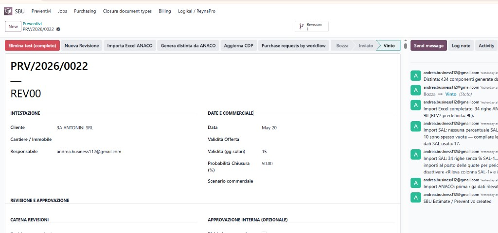

### Cosa mostra la schermata

*(Scheda compilata da screenshot — maggio 2026)*

- Menu **SBU** in alto: accesso dedicato Suburban (Preventivi, Jobs, Acquisti, SAL, documenti, ecc.).
- Un **preventivo** completo: codice **PRV/2026/0022**, revisione **REV00**.
- Stato **Vinto** (barra in alto a destra: Bozza → Inviato → **Vinto**): l’offerta è stata accettata.
- Cliente **3A ANTONINI SRL**, responsabile commerciale, data e validità offerta.
- Pulsanti operativi: **Nuova revisione**, **Importa Excel ANACO**, **Genera distinta da ANACO**, collegamenti ad acquisti / CDP.
- A destra, il **registro attività** (storico): import Excel, generazione distinta (es. 434 componenti), passaggio a Vinto.

*Nota per il presentatore:* in versioni precedenti poteva comparire in testa anche **Elimina test (completo)**; dalla versione **19.0.1.0.73** la pulizia test è **solo dalla lista preventivi** (Scheda 2), per non confondere gli utenti in produzione.

### Cosa fare su questa schermata

1. Aprire **SBU → Preventivi** e cercare il preventivo (es. PRV/2026/0022).  
2. Verificare **stato = Vinto** e cliente corretto.  
3. Per demo: mostrare **Importa Excel ANACO** / **Genera distinta da ANACO** solo se si deve aggiornare il dato; altrimenti scorrere le schede (ANACO, Distinta, SAL).  
4. Cliccare il smart button **Revisioni** o il link alla **commessa** se già creata (da mostrare in una scheda successiva).  
5. **Non** usare pulsanti di test in produzione; la pulizia dati prova è solo in lista (Scheda 2).

### Cosa dire al cliente (script)

1. **«Questo è il cuore del sistema: il preventivo digitale che sostituisce il foglio ANACO in Excel.»**  
   Ogni offerta ha un numero univoco (PRV/anno/numero) e revisioni (REV00, REV01…) come già fate oggi.

2. **«Il cliente e il cantiere sono in intestazione; tutto il team vede la stessa versione.»**  
   Niente file sparsi: una sola fonte dati in Odoo.

3. **«Quando l’offerta è vinta, lo stato diventa “Vinto” — da qui si crea la commessa e parte l’esecuzione.»**  
   Il passaggio Bozza → Inviato → Vinto traccia il ciclo commerciale.

4. **«I pulsanti “Importa Excel ANACO” e “Genera distinta da ANACO” servono per caricare o aggiornare i dati dal vostro modello Excel e costruire la distinta materiali senza ridigitare.»**  
   Nel log a destra si vede che, per questo preventivo, sono state importate le righe e generate centinaia di componenti in distinta.

5. **«A destra c’è lo storico: chi ha fatto cosa e quando — utile per controllo e audit.»**  
   Come una timeline del documento (import, approvazioni, cambi stato).

### Valore per Suburban

| Prima (Excel + file vari) | Con Odoo SBU |
|---------------------------|--------------|
| Preventivo isolato | Preventivo collegato a commessa, SAL, acquisti, fatture |
| Revisioni manuali | Catena revisioni e storico in un click |
| Distinta rifatta a mano | Distinta generata da ANACO / catalogo |
| Poca tracciabilità | Registro attività su ogni preventivo |

### Domande frequenti del cliente

- **«Dobbiamo smettere di usare Excel?»** — Potete ancora importare da ANACO; l’obiettivo è lavorare in Odoo e usare Excel solo come ponte o per casi particolari.  
- **«Cosa succede dopo “Vinto”?»** — Si apre la **commessa** (progetto), le **richieste di acquisto**, i **fogli SAL** e la **fatturazione** collegati a questo preventivo (altre schermate da aggiungere al report).

---

## Scheda 2 — Lista preventivi e azioni (pulizia test UAT)

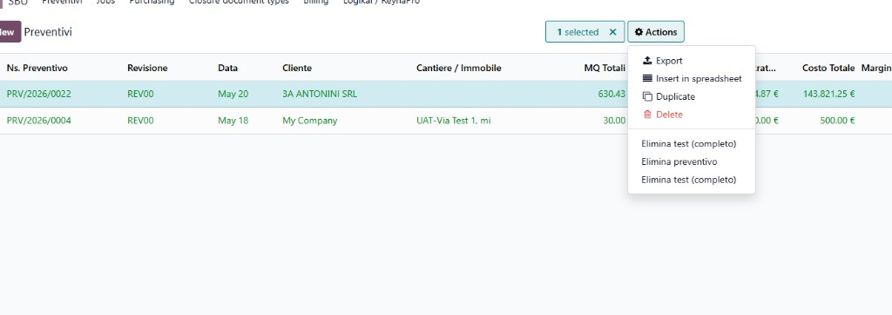

### Cosa mostra la schermata

*(Scheda compilata da screenshot — maggio 2026)*

- Vista **lista** di tutti i preventivi (colonne: numero, revisione, data, cliente, cantiere, mq, costo).
- Una riga selezionata (**PRV/2026/0022** — 3A ANTONINI SRL).
- Menu **Azioni** (ingranaggio): oltre alle funzioni standard Odoo (Esporta, Duplica, Elimina), compaiono azioni SBU:
  - **Elimina test (completo)** — rimuove preventivo di prova **e** dati collegati (commessa, SAL, fatture di test, ecc.) dopo conferma.
  - **Elimina preventivo** — eliminazione “semplice” (solo se il sistema lo consente, es. bozze senza commessa).

*Nota per il presentatore:* se vedete **due volte** «Elimina test (completo)», aggiornate il modulo **SBU Estimate** alla versione **≥ 19.0.1.0.73**; resterà una sola voce. Questa funzione è per **ambiente di test / formazione**, non per cancellare commesse reali in produzione.

### Cosa fare su questa schermata

1. Andare in **SBU → Preventivi** (vista **lista**, non scheda singola).  
2. Selezionare la riga con la spunta a sinistra.  
3. Cliccare **Azioni** (ingranaggio).  
4. **Produzione / demo cliente:** usare **Esporta**, **Duplica** — **non** «Elimina test (completo)».  
5. **Solo UAT interno:** «Elimina test (completo)» → spuntare conferma nel wizard → elimina preventivo + commessa/SAL di prova collegati.  
6. «Elimina preventivo» funziona solo su bozze senza vincoli; su **Vinto** darà errore (comportamento corretto).

### Cosa dire al cliente (script)

1. **«Dalla lista avete il catalogo di tutte le offerte: filtri, ricerca e export come in un gestionale moderno.»**

2. **«Selezionando una o più righe, il menu Azioni permette operazioni di massa — per esempio export verso Excel o foglio di calcolo.»**

3. **«La voce “Elimina test (completo)” esiste solo per pulire i dati di prova creati durante i test — con un wizard di conferma che elenca cosa verrà rimosso.»**  
   In produzione, su offerte vinte e commesse attive, **non si usa** questa voce; le commesse si chiudono con il flusso di **chiusura commessa** e archivio.

4. **«“Elimina preventivo” è l’eliminazione standard: funziona sulle bozze; su preventivi vinti il sistema blocca l’operazione per proteggere i dati collegati.»**  
   È una **sicurezza**, non un limite: evita di cancellare per errore una commessa con fatture e acquisti.

### Valore per Suburban

- Lista unica per commerciale e back-office.  
- Separazione chiara tra **dati di test** (pulizia guidata) e **dati reali** (regole di blocco).  
- Allineamento con audit: niente cancellazioni “silenziose” su preventivi vinti.

### Cosa NON dire al cliente

- Non presentare «Elimina test» come funzione quotidiana di produzione.  
- Non promettere cancellazione libera di commesse fatturate: il sistema è volutamente restrittivo.

---

## Scheda 3 — Home Odoo (griglia applicazioni)

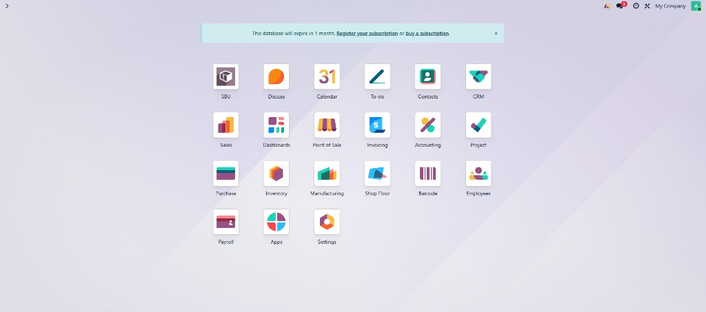

### Cosa mostra la schermata

*(Scheda compilata da screenshot — maggio 2026)*

- **Pagina iniziale** di Odoo dopo il login: la **griglia delle applicazioni** (moduli installati).
- In evidenza l’app **`SBU`** (icona pacco / modulo personalizzato Suburban): è l’**ingresso principale** al flusso preventivo → commessa → acquisti → SAL.
- Altre app Odoo standard visibili: **Progetti**, **Acquisti**, **Magazzino**, **Contabilità** / **Fatturazione**, **CRM**, **Vendite**, **Impostazioni**, ecc.
- In alto: messaggio di **scadenza database** (*«This database will expire in 1 month…»*) — tipico di ambiente **Odoo.sh / trial**; in produzione va gestito l’**abbonamento** Odoo.
- In alto a destra: azienda selezionata (**My Company** da impostare su **Suburban** in produzione), notifiche, utente connesso.

### Cosa fare su questa schermata

1. Dopo il login, restare su questa **home** per orientare il cliente.  
2. Cliccare **`SBU`** per entrare nel flusso Suburban (Preventivi, Jobs, …).  
3. Verificare in alto a destra che l’**azienda** sia quella corretta (es. Suburban SRL) — se compare *My Company*, cambiarla prima della demo.  
4. **Non** aprire tutte le app a caso: per la demo seguire l’ordine del report (SBU → Preventivi → …).  
5. Per il messaggio di scadenza: in riunione cliente spiegare che è **amministrativo Odoo.sh**, non un errore del progetto SBU; in seguito si registra l’abbonamento.

### Cosa dire al cliente (script)

1. **«Questa è la “home” di Odoo: un unico portale web, senza installare programmi sul PC.»**

2. **«L’applicazione SBU è il vostro ambiente di lavoro dedicato: da lì partono preventivi, commesse e collegamenti a acquisti e fatturazione.»**

3. **«Le altre icone sono i moduli standard Odoo — contabilità, magazzino, progetti — già collegati ai dati SBU quando servono.»**

4. **«In alto a destra si vede con quale azienda e utente si sta lavorando; in produzione sarà sempre Suburban e i profili del vostro team.»**

5. **«Il banner sulla scadenza riguarda la licenza/hosting Odoo: in go-live si attiva l’abbonamento; non influisce sulle funzioni che vi mostriamo oggi.»**

### Valore per Suburban

| Prima | Con Odoo SBU |
|-------|----------------|
| Più strumenti scollegati (Excel, mail, cartelle) | Un’unica **home** e un’app **SBU** per il flusso operativo |
| Accesso disperso | Stesso login per commerciale, acquisti, amministrazione |
| Moduli generici | **SBU** + Progetti / Acquisti / Contabilità integrati |

### Cosa NON dire al cliente

- Non dire che il database “sta per sparire” senza spiegare che è **registrazione abbonamento Odoo.sh**.  
- Non presentare tutte le 20+ app come se dovessero usarle tutte subito: focus su **SBU** e sul flusso concordato.  
- Non lasciare **My Company** visibile in demo finale: impostare il nome cliente reale.

---

## Scheda 4 — Menu SBU e lista preventivi

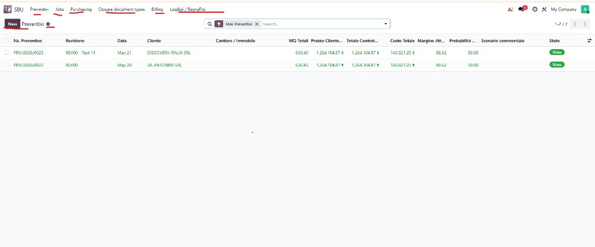

### Cosa mostra la schermata

*(Scheda compilata da screenshot — maggio 2026)*

- **Menu orizzontale SBU** (barra in alto, evidenziata in demo):  
  **Preventivi** · **Jobs** (commesse) · **Purchasing** (acquisti) · **Closure document types** (tipi documento chiusura) · **Billing** (SAL / fatturazione) · **Logikal / ReynaPro** (import tecnico).
- Vista **lista Preventivi**: tutte le offerte con colonne commerciali e di controllo.
- **Filtro attivo:** «Miei Preventivi» — mostra solo i preventivi del responsabile collegato all’utente.
- **Due preventivi vinti** (badge verde **Vinto**), es.:  
  - **PRV/2026/0023** — DISCOVERY ITALIA SRL (REV00 — Test 11)  
  - **PRV/2026/0022** — 3A ANTONINI SRL (caso P1002 / UAT)  
- Per entrambi (stesso ordine di grandezza): **~630 mq**, **prezzo cliente / totale contratto ~1.264.104,87 €**, **costo totale ~143.821,25 €**, **margine atteso ~88,6%**, probabilità 50%.
- Pulsante **New** per creare un nuovo preventivo; ricerca e paginazione (1–2 / 2).

### Cosa fare su questa schermata

1. Dopo la **home** (Scheda 3), cliccare **`SBU`** poi restare su **Preventivi** (o cliccare **Preventivi** nel menu).  
2. Mostrare il **menu SBU** come “mappa” del flusso: *Preventivi → Jobs → Purchasing → Billing → Chiusura*.  
3. Aprire un preventivo **Vinto** (es. **PRV/2026/0022**) cliccando sulla riga o sul numero.  
4. Opzionale: togliere il filtro «Miei Preventivi» per mostrare **tutti** i preventivi del team (icona × sul filtro).  
5. Per demo commessa: dopo il preventivo, usare **Jobs** dal menu.  
6. **Azioni** (ingranaggio) sulla riga selezionata: vedi Scheda 2 (export, elimina test solo UAT).

### Cosa dire al cliente (script)

1. **«Questa è la centrale dei preventivi: numeri PRV, revisione, cliente, mq, prezzo, costo e margine in un’unica lista.»**

2. **«Il menu in alto è il percorso Suburban: dall’offerta (Preventivi) alla commessa (Jobs), agli acquisti (Purchasing), alla fatturazione SAL (Billing) e alla chiusura documentale.»**

3. **«Lo stato “Vinto” indica offerte accettate — come per 3A ANTONINI e Discovery Italia nell’esempio — pronte per l’esecuzione su commessa.»**

4. **«Vedete affiancati prezzo di vendita, costo e margine: il sistema calcola il margine atteso senza fogli Excel paralleli.»**

5. **«Il filtro “Miei Preventivi” permette a ogni commerciale di vedere le proprie offerte; il responsabile può vedere l’elenco completo togliendo il filtro.»**

6. **«Da “New” si crea un nuovo preventivo; da import ANACO (nella scheda singola) si caricano i dati dal vostro Excel.»**

### Valore per Suburban

| Prima | Con Odoo SBU |
|-------|----------------|
| Excel + elenchi mail | **Lista unica** con stato, margine e contratto |
| Menu disperso | **Menu SBU** = flusso aziendale in un colpo d’occhio |
| Poca visibilità su vinti/persi | Badge **Vinto** / filtri per pipeline commerciale |

### Cosa NON dire al cliente

- Non dire che **tutti** i preventivi avranno sempre lo stesso margine/costo: dipendono da import e distinta.  
- Non confondere **Billing** con solo “fatture passive”: qui è il legame al **SAL** e fatturazione avanzamento.  
- Non usare **Logikal / ReynaPro** in demo se il cliente non usa quell’integrazione, salvo che sia nel perimetro.

---

## Scheda 5 — Preventivo dopo import Excel ANACO

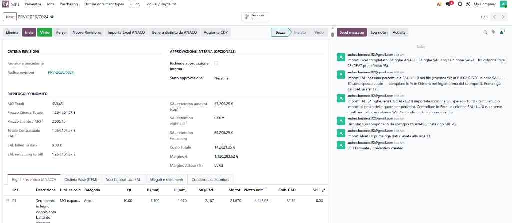

### Cosa mostra la schermata

*(Scheda compilata da screenshot — maggio 2026)*

- Preventivo **PRV/2026/0024** in stato **Bozza** (barra: Bozza → Inviato → Vinto).
- Appena completato **Importa Excel ANACO**: nel registro a destra compare  
  *«Import Excel completato: 34 righe ANACO, 34 righe SAL»*.
- **Riepilogo economico** popolato automaticamente dall’import:
  - **MQ totali:** 630,43  
  - **Prezzo cliente / totale contrattuale SAL:** 1.264.104,87 €  
  - **Cap garanzia SAL (retention):** 63.205,25 €  
  - **Costo totale:** 143.821,25 €  
  - **Margine:** 1.120.283,62 € (**88,62 %**)
- Scheda attiva **Righe preventivo (ANACO)** — es. posizione **F1** (serramento), qty 10, prezzo unitario 4.443,06 €.
- Altre schede già utilizzabili: **Distinta base (ITEM)**, **Voci contrattuali SAL**, allegati, condizioni.
- Messaggi nel log: prima riga dati Excel alla **riga 13**; **434 componenti** distinta generati/collegati da costi ANACO; nota se nel file mancano percentuali SAL-1…10 (colonne vuote → da completare in Odoo o in Excel prima di re-import).

### Cosa fare su questa schermata

1. Dopo l’import, **salvare** e aprire il **registro attività** (destra) per verificare il messaggio di successo (34+34 righe).  
2. Controllare **Riepilogo economico** vs attese del file Excel (P1002 / offerta cliente).  
3. Scheda **Righe preventivo (ANACO)** — scorrere le ~34 posizioni; aprire una riga (es. F1) se serve dettaglio costi.  
4. Scheda **Voci contrattuali SAL** — se il log segnala SAL % mancanti nel file, inserire le percentuali (o correggere Excel e **re-import**).  
5. Cliccare **Genera distinta da ANACO** (se non già eseguito in import) → verificare scheda **Distinta base** e conteggio componenti (~434).  
6. Flusso demo successivo: **Invia** / approvazione interna (se attiva) → **Vinto** → creazione **commessa** (Jobs).  
7. In **Bozza** è disponibile **Elimina** (preventivo semplice); su preventivi vinti usare solo flussi produzione (non elimina test in scheda).

### Cosa dire al cliente (script)

1. **«Abbiamo caricato il vostro foglio ANACO: in pochi secondi Odoo ha creato le righe di preventivo e le voci SAL collegate, senza digitazione manuale.»**

2. **«Il riquadro economico è lo stesso “pannello” che usavate in Excel: metri quadri, prezzo cliente, costi, margine in euro e in percentuale — aggiornato in automatico.»**

3. **«Vedete 34 posizioni ANACO e 34 voci contrattuali SAL: sono allineate al modello P1002 / struttura offerta.»**

4. **«La distinta materiali (oltre 400 componenti) può essere generata dai costi ANACO: è il ponte verso acquisti e magazzino.»**

5. **«Se nel file Excel mancano le percentuali di avanzamento SAL per periodo, il sistema lo segnala nel log: si possono completare qui o nel file e re-importare — nessuna sorpresa a fine commessa.»**

6. **«Da “Bozza” si può ancora revisionare; quando l’offerta è approvata si passa a “Vinto” e si apre la commessa.»**

### Valore per Suburban

| Prima (solo Excel) | Dopo import in Odoo |
|--------------------|---------------------|
| Copy/incolla manuale | **Import ANACO** con rilevamento riga dati (es. riga 13) |
| Formule isolate nel file | **Riepilogo economico** e margine live in Odoo |
| Distinta separata | **Genera distinta da ANACO** + tab ITEM |
| SAL su fogli diversi | **34 voci SAL** create insieme al preventivo |

### Cosa NON dire al cliente

- Non dire che «tutto è sempre automatico al 100%» senza citare le **eccezioni** (SAL % vuote, righe da validare).  
- Non saltare il messaggio nel log: mostra **trasparenza** e controllo qualità dati.  
- Non passare subito a **Vinto** senza far vedere almeno una riga ANACO e il riepilogo economico.

---

## Scheda 6 — Commessa (Job): contatori in testata

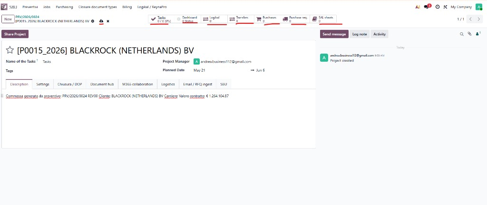

### Cosa mostra la schermata

*(Scheda compilata da screenshot — maggio 2026)*

- **Commessa / Job** creata dal preventivo vinto: **[P0015_2026] BLACKROCK (NETHERLANDS) BV**.
- Origine in descrizione: preventivo **PRV/2026/0024 REV00**, valore contratto **€ 1.264.104,87**.
- Responsabile progetto, date pianificate (es. 21 mag → 6 giu).
- **Riquadri in testata (evidenziati in demo)** — contatori e accessi rapidi SBU; nella foto sono a **zero** perché la commessa è appena stata creata.

| Contatore (UI) | Significato per Suburban | Cosa si apre / quando cresce |
|----------------|--------------------------|------------------------------|
| **Tasks** | Attività / task Odoo standard sul progetto | Pianificazione interna, checklist operative (0/0 = nessun task ancora) |
| **Dashboard** | Cruscotto stato commessa (modulo SBU) | Sintesi avanzamento custom; **0 Status** = nessun indicatore ancora calcolato |
| **Logikal** | Import / legame **Logikal** (serramenti) | Batch import da Logikal; **0** = nessun import legato a questa commessa |
| **Transfers** | **Movimenti di magazzino** (trasferimenti) collegati al job | Ricevimenti / consegne verso cantiere; aumenta con logistica attiva |
| **Purchases** | **Ordini di acquisto** (PO) confermati | Fornitori, ordini emessi; **0** finché non si crea RFQ/PO da RDA |
| **Purchase req.** | **Richieste di acquisto (RDA)** | Richieste materiali da preventivo/distinta; primo passo dopo distinta |
| **SAL sheets** | **Fogli SAL** (Stato Avanzamento Lavori) | Avanzamento lavori e fatturazione; **0** finché non si crea il primo SAL |

- Schede sotto: **Description**, **Settings**, **Chiusura / DOP**, **Document hub**, **M365**, **Logistics**, **Email / RFQ ingest**, **SBU**.
- Registro: *«Project created»* — commessa appena generata.

### Cosa fare su questa schermata

1. Dopo **Vinto** sul preventivo, aprire **Jobs** e la commessa **[P0015_2026]** (codice anno + progressivo).  
2. **Leggere la descrizione**: collegamento a **PRV/2026/0024** e valore contratto — prova tracciabilità preventivo → commessa.  
3. **Spiegare i contatori** uno per uno (tabella sopra); sottolineare che a **0** è normale all’inizio.  
4. Percorso demo tipico che **aumenta i numeri**:  
   - **Purchase req.** → creare RDA da distinta  
   - **Purchases** → RFQ / ordine fornitore  
   - **Transfers** → ricevimento magazzino  
   - **SAL sheets** → primo foglio SAL + fattura  
   - **Logikal** / **Dashboard** — solo se nel perimetro cliente  
5. Mostrare tab **Document hub** / **Chiusura / DOP** in un secondo momento (altre schede).  
6. **Tasks**: opzionale — task interni team; non confonderli con SAL.

### Cosa dire al cliente (script)

1. **«Questa è la commessa: il “contenitore” di tutto ciò che succede dopo che l’offerta è vinta — dal codice P0015_2026 vedete anno e progressivo.»**

2. **«In alto non sono errori: sono **Collegamenti rapidi**. Partono da zero e si aggiornano man mano che lavorate la commessa.»**

3. **«Purchase req. = richieste d’acquisto (RDA) dai materiali del preventivo; Purchases = ordini ai fornitori; Transfers = movimenti a magazzino/cantiere.»**

4. **«SAL sheets = fogli di avanzamento lavori e fatturazione verso il cliente — il cuore del SAL che avevate in Excel, ora sulla commessa.»**

5. **«Logikal resta per chi importa listini/serramenti da Logikal; Dashboard è il cruscotto di stato commessa.»**

6. **«Tasks sono le attività interne del team (come un todo su progetto); non sostituiscono il SAL commerciale.»**

7. **«Nella descrizione vedete sempre da quale preventivo (PRV/2026/0024) e a quale valore contratto fa riferimento — audit e controllo.»**

### Valore per Suburban

| Contatore | Perché serve |
|-----------|----------------|
| Purchase req. / Purchases | Traccia **acquisti** legati al preventivo, non ordini “scollegati” |
| Transfers | Collega **magazzino** alla commessa |
| SAL sheets | **Avanzamento e fatture** sullo stesso job |
| Logikal | Integrazione **tecnica** senza doppio inserimento |
| Dashboard | Vista **sintetica** per direzione / PM |
| Tasks | Coordinamento **operativo** interno |

### Cosa NON dire al cliente

- Non dire che **0 = problema**: all’apertura commessa è **normale**.  
- Non promettere che **Dashboard** e **Logikal** sono attivi se non sono nel go-live.  
- Non confondere **SAL sheets** con **Tasks** (fatturazione vs todo interni).

---

## Scheda 7 — Foglio SAL: focus sulla % SAL (questo periodo)

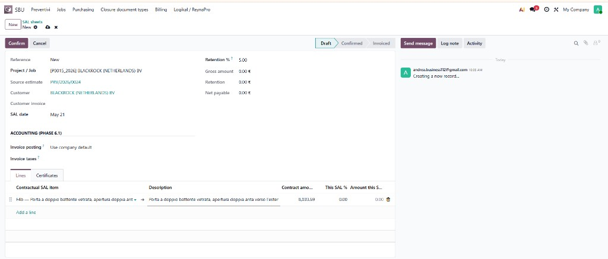

### Cosa mostra la schermata

*(Scheda compilata da screenshot — maggio 2026)*

- **Nuovo foglio SAL** (Stato Avanzamento Lavori) in stato **Draft / Bozza**, commessa **[P0015_2026] BLACKROCK**, preventivo origine **PRV/2026/0024**.
- **Data SAL:** 21 maggio · **Ritenuta / garanzia:** 5,00 % (trattenuta sul lordo).
- **Importi in testata** (Lordo, Ritenuta, Netto da pagare): tutti **0,00 €** finché non si inseriscono le **% SAL** sulle righe.
- Scheda **Lines / Righe:** una riga per **voce contrattuale SAL** (es. **F4b** — porta a doppio battente, importo contratto **8.033,59 €**).
- Colonna chiave **`This SAL %` / % SAL di questo periodo:** percentuale di avanzamento **solo per questo foglio SAL** (es. 0,00 % → importo periodo 0,00 €).
- Colonna **`Amount this SAL` / Importo questo SAL:** calcolata automaticamente:  
  **Importo periodo = Importo contratto × (% SAL questo periodo ÷ 100)** (con regole cumulative del modulo).
- Altre colonne (non sempre visibili): % cumulata, già fatturato, residuo — dipendono dalla vista.

**Differenza importante da spiegare al cliente**

| Concetto | Dove si vede | Significato |
|----------|--------------|-------------|
| **% SAL sul preventivo / Excel** | Import ANACO, tab *Voci contrattuali SAL* | Pianificazione / ripartizione contratto (SAL-1…SAL-10) |
| **% SAL su questo foglio** | Colonna **This SAL %** | Quanto si fattura **in questo mese / periodo** su quella voce |
| **Ritenuta %** | Testata foglio (5 %) | Trattenuta a garanzia sul **lordo** del periodo |

### Cosa fare su questa schermata

1. Aprire il foglio SAL dalla commessa (**SAL sheets** → New) o da **Billing**.  
2. Verificare **commessa**, **cliente** e **preventivo** origine corretti.  
3. Per ogni voce lavorata nel periodo, inserire **`This SAL %`** (es. **10** se si fattura il 10 % del valore contratto di quella voce in questo SAL).  
4. Controllare che **`Amount this SAL`** si aggiorni (es. 8.033,59 × 10 % = 803,36 € su una riga).  
5. Verificare in testata **Lordo**, **Ritenuta** (5 %), **Netto** (lordo − ritenuta).  
6. **Salvare** → **Conferma** foglio SAL → poi **Crea fattura** / CDP (passi successivi demo).  
7. **Non** lasciare 100 % su tutte le righe se in Excel le colonne SAL erano vuote: si usa la % **del periodo**, non “tutto il contratto” in un colpo solo (salvo ultimo SAL di saldo).

### Cosa dire al cliente (script) — focus % SAL

1. **«Ogni foglio SAL è un “periodo di fatturazione”: qui dichiariamo quanto lavoro è stato fatto **in questo intervallo**, non l’intero contratto.»**

2. **«Nella colonna **% SAL di questo periodo** mettiamo la percentuale da fatturare ora su quella voce — esempio F4b porte: se in questo mese fatturiamo il 10 % del valore contratto della voce, scriviamo 10.»**

3. **«Il sistema calcola da solo l’**importo di questo SAL** sulla riga e il totale in alto: non dovete rifare le moltiplicazioni in Excel.»**

4. **«La **ritenuta del 5 %** in testata è la garanzia sul lordo del periodo: il netto da pagare è ciò che il cliente paga dopo trattenuta.»**

5. **«Le percentuali nell’Excel ANACO (SAL-1, SAL-2…) servono a **pianificare** il contratto; su questo foglio inseriamo la % **effettiva del mese** — possono coincidere ma non sono la stessa cosa.»**

6. **«Finché le % sono a zero, lordo e netto restano zero: è normale in bozza prima di compilare l’avanzamento.»**

### Esempio numerico (da usare in demo — voce F4b)

- Importo contratto voce: **8.033,59 €**  
- **This SAL %** inserita: **10**  
- **Importo questo SAL:** circa **803,36 €** (prima di ritenuta)  
- Ritenuta 5 % sul lordo totale foglio → netto = lordo × 95 %

### Valore per Suburban

| Prima (Excel SAL) | Con foglio SAL in Odoo |
|-------------------|-------------------------|
| % e importi in celle separate | **% periodo** → importo riga automatico |
| Rischio errori di formula | Totali lordo / ritenuta / netto in testata |
| SAL scollegato da fattura | Stesso foglio → conferma → fattura cliente |

### Cosa NON dire al cliente

- Non dire che **This SAL %** è sempre “cumulativa totale” senza chiarire che è la % **di questo foglio** (il modulo gestisce anche cumuli — seguire la procedura concordata).  
- Non inserire **100 %** su tutte le voci “per prova” in produzione: gonfia fatturato e garanzia.  
- Non confondere **Retention %** (5 % in testata) con **% SAL** sulla riga.

---

## Scheda 8 — Fattura cliente da SAL (righe fattura)

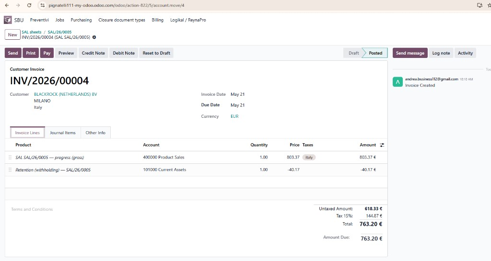

### Cosa mostra la schermata

*(Scheda compilata da screenshot — maggio 2026)*

- **Fattura cliente** **INV/2026/00004** generata dal foglio **SAL/26/0005** (percorso: *SAL sheets → SAL/26/0005 → fattura*).
- Stato **Posted / Contabilizzata** (non più bozza): documento ufficiale verso **BLACKROCK (NETHERLANDS) BV**.
- **Due righe fattura** (modello SBU con ritenuta):
  1. **`SAL … — progress (gross)`** — avanzamento **lordo** del periodo: **803,37 €** (coerente con ~10 % su voce F4b ~8.033 € dal foglio SAL).
  2. **`Retention (withholding)`** — **ritenuta / garanzia 5 %**: **−40,17 €** (5 % di 803,37 ≈ 40,17).
- **Totali fattura:** imponibile + IVA → **Totale da pagare 763,20 €** (803,37 − 40,17 prima di IVA; IVA 15 % su base imponibile come da configurazione italiana).
- Collegamento esplicito al **SAL**: ogni fattura resta tracciabile al foglio di avanzamento.

### Cosa fare su questa schermata

1. Aprire la fattura **dal foglio SAL confermato** (pulsante crea fattura / link INV/…).  
2. Scheda **Invoice lines / Righe fattura**: verificare **lordo SAL** e riga **ritenuta negativa**.  
3. Controllare **cliente**, **date**, **valuta EUR**.  
4. Se bozza: rivedere importi; se **Posted**: usare **Anteprima / Invia / Registra pagamento** (a seconda del processo).  
5. Passare alla scheda **Journal items** (Scheda 9) per spiegare la contabilità al cliente amministrativo.  
6. **Non** modificare importi a mano se la fattura viene dal SAL: correggere **% SAL** sul foglio e rigenerare, se necessario.

### Cosa dire al cliente (script)

1. **«Dal foglio SAL con la % inserita, Odoo genera la fattura cliente in un passaggio: stesso importo lordo che avete visto sul SAL.»**

2. **«La prima riga è l’avanzamento lordo del periodo; la seconda è la ritenuta a garanzia (5 %): è negativa perché riduce ciò che il cliente paga subito, non il valore del lavoro.»**

3. **«Il totale da pagare (763,20 € nell’esempio) è ciò che compare in scadenza pagamenti — dopo ritenuta e con IVA secondo le impostazioni aziendali.»**

4. **«In alto vedete il legame SAL/26/0005: in audit sapete sempre quale avanzamento ha generato quale fattura.»**

5. **«Stato “Contabilizzata” significa che le scritture in prima nota sono state create — passo successivo: incasso e certificato di pagamento (CDP) se previsto.»**

### Collegamento % SAL → fattura (esempio da ripetere in demo)

| Passo | Valore |
|-------|--------|
| Voce F4b — contratto | 8.033,59 € |
| **This SAL %** (Scheda 7) | 10 % |
| Lordo periodo (foglio / fattura) | ~803,37 € |
| Ritenuta 5 % | ~40,17 € |
| Netto prima IVA (circa) | ~763,20 € |

---

## Scheda 9 — Fattura cliente: scritture contabili (Journal items)

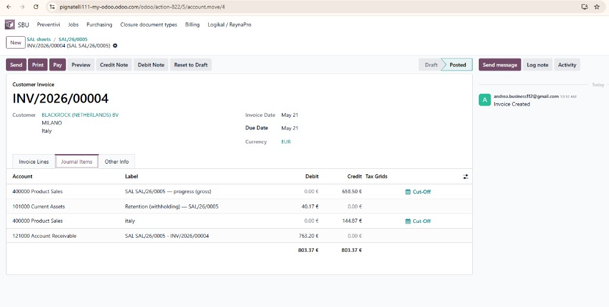

### Cosa mostra la schermata

*(Scheda compilata da screenshot — maggio 2026)*

- Stessa fattura **INV/2026/00004** (SAL **SAL/26/0005**), scheda **Journal items / Scritture contabili**.
- **Quadratura contabile** (totale Dare = Avere = **803,37 €**):
  - **Avere 658,50 €** — ricavi vendita (lordo netto di IVA su vendita, conto 400000).
  - **Avere 144,87 €** — IVA 15 % (conto ricavi / imposta secondo configurazione).
  - **Dare 40,17 €** — **ritenuta** registrata (conto 101000 Current assets nell’esempio: credito vs cliente / deposito garanzia).
  - **Dare 763,20 €** — **credito vs cliente** (121000 Account receivable): importo da incassare.
- Per il cliente “contabile”: la fattura non è solo PDF — è **integrata nella contabilità Odoo**.

### Cosa fare su questa schermata

1. Dalla fattura Posted, aprire scheda **Journal items**.  
2. Mostrare che **Dare = Avere** (partita doppia).  
3. Evidenziare riga **Retention** (Dare) e **Account receivable** (Dare 763,20).  
4. Opzionale: aprire conto **121000** o registrazione pagamento in demo successiva.  
5. Tornare al **foglio SAL** / **commessa** per mostrare aggiornamento “fatturato” (se visibile su preventivo).

### Cosa dire al cliente (script)

1. **«Questa scheda è per l’amministrazione: ogni fattura SAL genera automaticamente le scritture in prima nota.»**

2. **«Il credito verso il cliente (763,20 €) è ciò che andrete a incassare; la ritenuta (40,17 €) resta tracciata separatamente come garanzia.»**

3. **«I ricavi e l’IVA sono ripartiti sui conti corretti del piano dei conti italiano — niente rettifiche manuali se il SAL è corretto.»**

4. **«La quadratura Dare/Avere garantisce che contabilità e fattura PDF coincidano.»**

### Valore per Suburban (Schede 8–9)

| Senza integrazione | Con SAL → fattura Odoo |
|--------------------|-------------------------|
| SAL Excel + fattura separata | Un flusso: **% SAL** → foglio → fattura |
| Ritenuta calcolata a mano | Riga **Retention** automatica |
| Contabilità duplicata | **Journal items** da stesso documento |

### Cosa NON dire al cliente

- Non dire che il cliente “paga 803,37” se il **totale da pagare** è 763,20 **con IVA** — distinguere **lordo avanzamento**, **ritenuta**, **IVA**, **netto a pagare**.  
- Non modificare scritture a mano sulla fattura SAL senza procedura contabile concordata.  
- Non saltare il legame **SAL/26/0005** in breadcrumb: è la tracciabilità richiesta in commessa pubblica / private.

---

## Scheda 10 — SAL fatturato + certificato di pagamento (CDP)

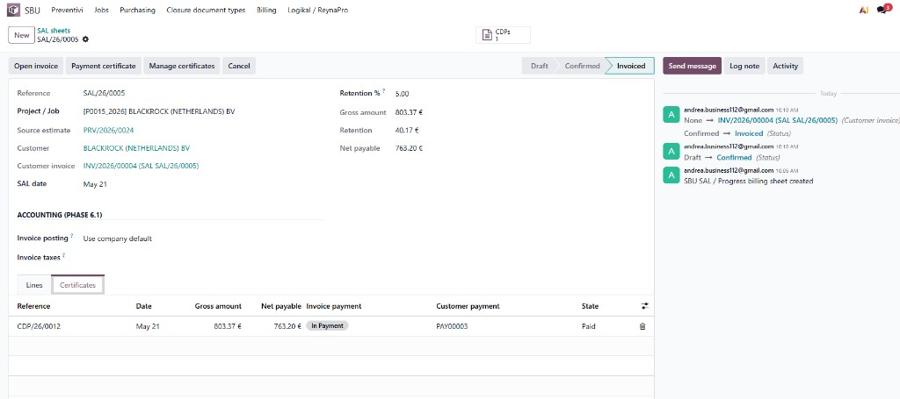

### Cosa mostra la schermata

*(Scheda compilata da screenshot — maggio 2026)*

- Foglio **SAL/26/0005** in stato **Invoiced / Fatturato** (workflow: Bozza → Confermato → **Fatturato**).
- Collegamenti completi:
  - Commessa **[P0015_2026] BLACKROCK**
  - Preventivo **PRV/2026/0024**
  - Fattura cliente **INV/2026/00004** (link cliccabile)
- Totali allineati alle Schede 7–9: **Lordo 803,37 €** · **Ritenuta 40,17 €** · **Netto 763,20 €**.
- Scheda **Certificates / Certificati**: **CDP/26/0012** — stessi importi, stato **Paid / Pagato**, pagamento cliente **PAY00003**, fattura **In Payment / In pagamento**.
- Pulsanti: **Apri fattura**, **Certificato di pagamento**, **Gestisci certificati**, **Annulla**.
- Log: creazione SAL → Confermato → collegamento fattura → **Fatturato**.

**Fine del ciclo SAL “periodo 1”:** avanzamento dichiarato → fattura emessa → certificato e incasso tracciati.

### Cosa fare su questa schermata

1. Mostrare la barra stato **Fatturato** — ciclo SAL chiuso per questo periodo.  
2. Cliccare **INV/2026/00004** — richiamo Scheda 8–9.  
3. Scheda **Certificates**: aprire **CDP/26/0012** — spiegare certificato di pagamento (documento verso cliente / PA).  
4. Verificare **Paid** e riferimento pagamento **PAY00003**.  
5. Tornare alla **commessa** (Jobs): contatore **SAL sheets** ≥ 1.  
6. **Prossimo workflow** (vedi sotto): nuovo periodo SAL, acquisti, o chiusura commessa.

### Cosa dire al cliente (script)

1. **«Questo è il riepilogo del primo SAL: dalla % inserita sulle righe siamo arrivati a fattura contabilizzata e certificato di pagamento pagato.»**

2. **«Tutto resta collegato: commessa, preventivo, foglio SAL, fattura INV/… e CDP/… — tracciabilità completa.»**

3. **«Il certificato di pagamento (CDP) documenta l’incasso / la richiesta di pagamento secondo il vostro processo; qui risulta **Pagato** con riferimento al movimento di incasso.»**

4. **«Il SAL è “Fatturato”: non si modifica più questo periodo; il prossimo avanzamento sarà un **nuovo foglio SAL** (mese 2, SAL-2, ecc.).»**

5. **«Lordo, ritenuta e netto sulla testata coincidono con fattura e CDP — un solo dato, non tre Excel diversi.»**

### Valore per Suburban

| Fase | Documento in Odoo |
|------|-------------------|
| Avanzamento | Foglio SAL + % righe |
| Fatturazione | Fattura cliente |
| Incasso | CDP + pagamento |
| Audit | Log + link incrociati |

---

## Prossimi passi del workflow (dopo SAL fatturato)

Usa questa sequenza per **continuare la demo** o il report (prossime foto consigliate).

```text
                    ┌─────────────────────────────────────┐
                    │  SAL periodo 1 — COMPLETATO (Scheda 10) │
                    │  % SAL → SAL → Fattura → CDP pagato     │
                    └─────────────────┬───────────────────┘
                                      │
          ┌───────────────────────────┼───────────────────────────┐
          ▼                           ▼                           ▼
   A) SAL periodo 2              B) Acquisti / magazzino      C) Chiusura commessa
   Nuovo foglio SAL              RDA → PO → Ricevimento      Tab Chiusura / DOP
   Nuove % su righe              Contatori Purchases /         Document hub
   Ripeti fino a 100%            Transfers su Job             Stato In chiusura
```

### A) Prossimo SAL (stesso cantiere)

| Passo | Dove | Azione |
|-------|------|--------|
| 1 | Commessa **[P0015_2026]** | **SAL sheets** → **New** |
| 2 | Nuovo foglio SAL | Inserire **% SAL del periodo 2** (non rifare il 10 % già fatturato, salvo regola cumulativa concordata) |
| 3 | Conferma → Fattura → CDP | Come Schede 7–10 |

**Cosa dire:** «Ogni mese (o ogni SAL-2, SAL-3…) apriamo un nuovo foglio; il preventivo tiene il residuo da fatturare.»

### B) Acquisti e logistica (in parallelo)

| Passo | Dove | Azione |
|-------|------|--------|
| 1 | Commessa | **Purchase req.** → RDA da distinta preventivo |
| 2 | | Approva RDA → **RFQ / Purchases** |
| 3 | Magazzino | **Transfers** — ricevimento materiali |

**Cosa dire:** «Fatturiamo al cliente (SAL) e nel contempo ordiniamo i materiali (RDA/PO) sulla stessa commessa.»

### C) Chiusura commessa (fine cantiere)

| Passo | Dove | Azione |
|-------|------|--------|
| 1 | Commessa | Tab **Chiusura / DOP** — checklist documenti |
| 2 | | Tab **Document hub** — link OneDrive / consegna |
| 3 | | Stato commessa → **In chiusura** → **Chiusa** (solo checklist completa) |

**Cosa dire:** «A fine lavori non si cancella la commessa: si completa la checklist DOP e si archivia.»

### Ordine suggerito per la prossima sessione foto

1. ~~**RDA** sulla commessa~~ → **Scheda 11**  
2. **Ordine acquisto** + ricevimento (Purchases / Transfers)  
3. **Secondo foglio SAL** (opzionale)  
4. **Chiusura / DOP** (Test 11)

---

## Scheda 11 — Richiesta di acquisto (RDA) — inizio workflow acquisti

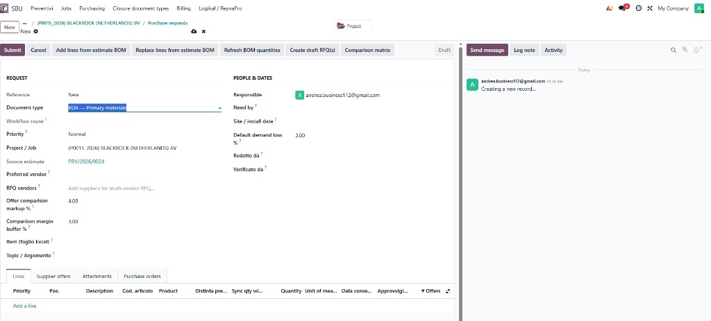

### Cosa mostra la schermata

*(Scheda compilata da screenshot — maggio 2026)*

- **Nuova richiesta di acquisto (RDA)** — tipo documento **RDA — Primary materials** (materiali principali).
- Collegata alla commessa **[P0015_2026] BLACKROCK (NETHERLANDS) BV** e al preventivo origine **PRV/2026/0024** (stessa catena del SAL).
- Stato **New / Nuovo** — non ancora inviata in approvazione.
- **Righe vuote** — il passo successivo è caricare i materiali dalla **distinta del preventivo** (BOM).
- Pulsanti chiave (barra azioni):
  - **Add lines from estimate BOM** — aggiunge righe dalla distinta senza cancellare le esistenti.
  - **Replace lines from estimate BOM** — sostituisce tutte le righe con la distinta aggiornata.
  - **Refresh BOM quantities** — ricalcola quantità da distinta (perdita %, MOQ).
  - **Submit** — invia la RDA in approvazione.
  - **Create draft RFQ(s)** — crea bozze ordine/RFQ verso fornitori (dopo approvazione).
  - **Comparison matrix** — matrice confronto offerte fornitori.
- Altri campi: priorità, responsabile, date (**Need by**, **Site / install date**), markup confronto offerte (+4 %), buffer margine (+3 %), fornitori RFQ multipli.

### Cosa fare su questa schermata (ordine demo)

1. Aprire la RDA dalla commessa (**Purchase req.** → New) o da **Purchasing**.  
2. Verificare **Project / Job** e **Source estimate** corretti.  
3. Cliccare **Add lines from estimate BOM** (o **Replace** se si vuole rigenerare tutto) → compariranno le righe materiali (es. da distinta ANACO / catalogo SBU).  
4. Controllare **Quantity**, prodotto, codice articolo; eventuale **Refresh BOM quantities**.  
5. Compilare **Need by** / fornitore preferito se serve.  
6. Cliccare **Submit** → stato **Submitted** → poi **Approve** (secondo permessi).  
7. **Create draft RFQ(s)** → passo successivo demo: **ordine acquisto** (Scheda da aggiungere).  
8. **Non** usare **Submit** prima di aver caricato le righe BOM (altrimenti RDA vuota).

### Cosa dire al cliente (script)

1. **«Dopo il SAL verso il cliente, sulla stessa commessa apriamo la **richiesta d’acquisto (RDA)**: è l’ordine interno per comprare i materiali previsti nel preventivo.»**

2. **«Vedete commessa e preventivo origine: acquisti e fatturazione non sono scatole separate — parlano della stessa job P0015.»**

3. **«Non digitiamo 400 righe a mano: **Aggiungi righe da distinta preventivo** porta i componenti dalla distinta generata dall’ANACO.»**

4. **«**Invia (Submit)** avvia l’approvazione interna; poi si possono creare le **richieste di offerta (RFQ)** ai fornitori e confrontare i prezzi (matrice +4 % / +3 % buffer).»**

5. **«Tipo RDA = materiali principali; altri tipi (ACO, ACP, ferramenta, vetro…) esistono per altri percorsi ANACO.»**

### Collegamento al flusso già mostrato

```text
PRV/2026/0024 → Import ANACO → Distinta (~434 righe)
       → Commessa P0015 → SAL fatturato (lato cliente)
       → RDA (lato fornitori) ← SIAMO QUI
       → PO / Ricevimento → Transfers
```

### Valore per Suburban

| Prima | Con RDA su commessa |
|-------|---------------------|
| Ordini mail / Excel | RDA tracciata su job + preventivo |
| Distinta copiata a mano | **BOM → righe RDA** in un click |
| Offerte su fogli separati | **Comparison matrix** in Odoo |

### Cosa NON dire al cliente

- Non presentare la RDA vuota come “finita” — mostrare sempre **Add lines from BOM** prima di Submit.  
- Non confondere **RDA** con **ordine d’acquisto (PO)** — la RDA è richiesta interna; il PO viene dopo RFQ/approvazione.

### Prossimo screenshot consigliato

RDA con **righe piene** dopo BOM → poi **Submit/Approved** → **Create draft RFQ** → schermata **Purchase order**.

---

## Scheda 12 — RFQ fornitore: perché gli importi sono 0 €

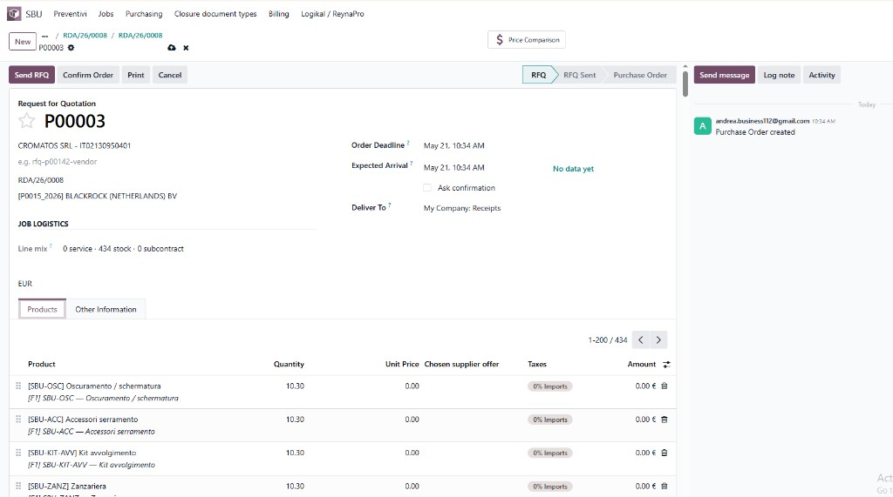

### Cosa mostra la schermata

*(Scheda compilata da screenshot — maggio 2026)*

- **Richiesta di offerta (RFQ)** **P00003** verso fornitore **CROMATOS SRL**, generata da **RDA/26/0008**, commessa **[P0015_2026]**.
- Stato **RFQ** (bozza): non ancora «RFQ Sent» né «Purchase Order» confermato.
- **434 righe stock** dalla distinta (prodotti catalogo **SBU-OSC**, **SBU-ACC**, **SBU-KIT-AVV**, **SBU-ZANZ**, …) — quantità corrette (es. **10,30**).
- Colonne critiche:
  - **Unit Price / Prezzo unitario: 0,00**
  - **Chosen supplier offer / Offerta fornitore scelta:** **vuota**
  - **Amount / Importo: 0,00 €** (= quantità × prezzo unitario)

### Perché l’importo è 0 € (spiegazione tecnica e commerciale)

| Motivo | Dettaglio |
|--------|-----------|
| **1. Nessun prezzo fornitore caricato** | Il RFQ è una **bozza per chiedere prezzi**. Fino a che non ci sono **offerte fornitore** sulla RDA (tab *Supplier offers*) o listini acquisto, il prezzo unitario resta **0**. |
| **2. Prodotti catalogo SBU senza costo acquisto** | Le righe arrivano dalla **distinta** con prodotti tipo **SBU-*** (placeholder UAT / ANACO). Nel catalogo **non** è impostato il prezzo d’acquisto fornitore — solo codice e descrizione. |
| **3. Il costo ANACO non va sul PO automaticamente** | Il **costo CAD** del preventivo serve a **margine e preventivazione**; **non** viene copiato sulla riga ordine fornitore per evitare di usare un costo interno al posto del prezzo negoziato con Cromatos. |
| **4. Logica Odoo SBU** | Alla creazione RFQ, `price_unit` si compila **solo se** esiste un’**offerta fornitore** (`sbu.purchase.request.offer`) con `unit_price` > 0 per quella riga e quel vendor. |
| **5. Fase workflow** | In stato **RFQ** è **normale** vedere 0 €: il passo successivo è **inviare RFQ**, raccogliere quotazioni, **Comparison matrix**, poi confermare PO con prezzi pieni. |

**Formula visibile in schermata:**  
**Importo riga = Quantità × Prezzo unitario** → 10,30 × **0,00** = **0,00 €**.

### Cosa fare su questa schermata

1. **Non** presentare 0 € come errore di calcolo: spiegare che mancano **prezzi fornitore**.  
2. Tornare alla **RDA/26/0008** → tab **Supplier offers** → inserire prezzi unitari Cromatos (o import da quotazione).  
3. Opzionale: sui prodotti **SBU-***, tab Acquisto → **vendor pricelist** (prezzi standard per Cromatos).  
4. Rigenerare RFQ o aggiornare righe PO dopo offerte scelte (**Chosen supplier offer** popolata).  
5. Usare **Price comparison / Comparison matrix** sulla RDA per scegliere l’offerta migliore (+4 % / +3 % buffer).  
6. Solo dopo prezzi compilati: **Send RFQ** → **Confirm Order** → controllare totale ≠ 0.  
7. Confronto budget: il sistema può confrontare PO con **costo preventivo** (alert over budget) — utile quando `price_unit` > 0.

### Cosa dire al cliente (script)

1. **«Vedete 434 righe materiali: la distinta dal preventivo è arrivata correttamente sul RFQ — quantità sì, prezzi ancora no.»**

2. **«Gli importi sono 0 € perché questo documento è una **richiesta di offerta**: stiamo chiedendo a Cromatos i prezzi, non confermando un ordine da 0 euro.»**

3. **«I codici SBU- sono articoli tecnici legati all’ANACO; il **costo nel preventivo** è per il margine commerciale, non sostituisce il prezzo d’acquisto del fornitore.»**

4. **«Quando inseriamo le offerte fornitori sulla RDA, la colonna “Offerta scelta” e il prezzo unitario si riempiono e l’importo si calcola da solo.»**

5. **«Prima di “Conferma ordine” verificheremo che i totali siano coerenti con il budget del preventivo (~144k costo totale su tutta la commessa, non su questa singola riga).»**

### Valore per Suburban

| Rischio evitato | Come funziona |
|-----------------|---------------|
| Ordine a prezzo sbagliato da costo interno | Prezzo PO solo da **offerta fornitore** |
| RFQ confuso con ordine firmato | Stati **RFQ → Sent → PO** |
| 434 righe digitate a mano | Quantità da **BOM** automatiche |

### Cosa NON dire al cliente

- Non dire «Odoo non calcola i totali» — calcola **quantità × prezzo**; il prezzo è volutamente vuoto finché manca la quotazione.  
- Non **Confirm Order** con tutti 0 € in produzione (solo accettabile in UAT se si spiega).  
- Non promettere che il prezzo ANACO/CAD si copia sempre sul PO — **no**, per scelta di processo.

### Prossimo screenshot consigliato

RDA tab **Supplier offers** con prezzi compilati → stesso RFQ con **Unit Price > 0** e **Chosen supplier offer** → oppure **Confirm Order** con totale.

---

## Flusso completo (richiamo per la chiusura demo)

Usa questo schema verbale dopo le schermate:

```text
Preventivo (ANACO) → Vinto → Commessa → Distinta / RDA → Ordini e ricevimenti
       → SAL → Fattura cliente → Certificato di pagamento (CDP) → Chiusura commessa
```

Schermate già in report: home Odoo → lista preventivi → import ANACO → commessa → % SAL → fattura → SAL fatturato + CDP.  
**Prossime foto consigliate:** **RDA**, **ordine acquisto / ricevimento**, **secondo SAL**, **Chiusura / DOP**, **Document hub**.

---

## Modello scheda (nuove foto — compilato dall’assistente)

```markdown
## Scheda N — [Titolo breve]


### Cosa mostra la schermata
- …

### Cosa fare su questa schermata
1. …

### Cosa dire al cliente (script)
1. «…»

### Valore per Suburban
| Prima | Con Odoo SBU |
|-------|----------------|
| … | … |

### Cosa NON dire al cliente (opzionale)
- …
```

---

## Riferimenti

- Report tecnico: [REPORT_CLIENTE_SBU_ODOO_IT.md](../REPORT_CLIENTE_SBU_ODOO_IT.md)  
- Guida test interna: [GUIDA_TEST_AUTONOMO_COSIMO.md](../guide/GUIDA_TEST_AUTONOMO_COSIMO.md)  
- Esportazione Word: [COME_ESPORTARE_REPORT_WORD.txt](../COME_ESPORTARE_REPORT_WORD.txt)

---

*Prossimo aggiornamento: inviare nuove screenshot in chat con la richiesta «aggiungi al report cliente».*
